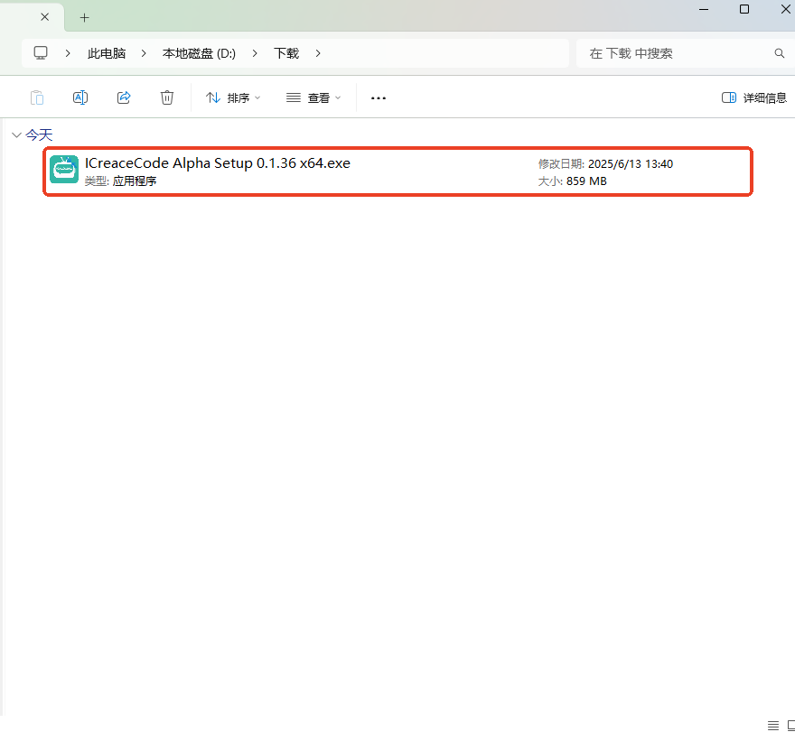
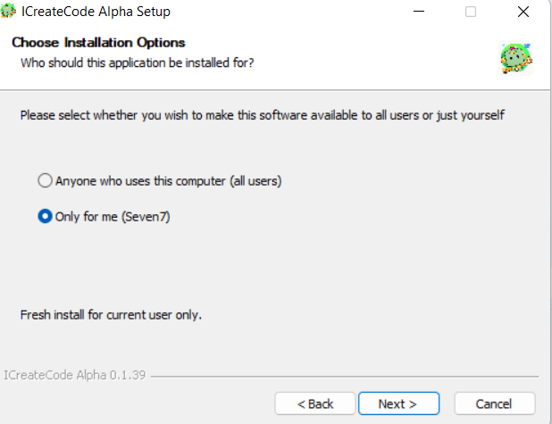
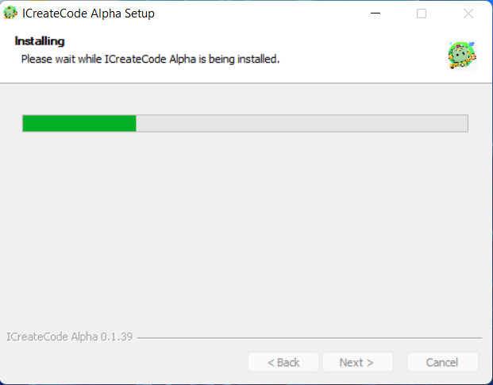
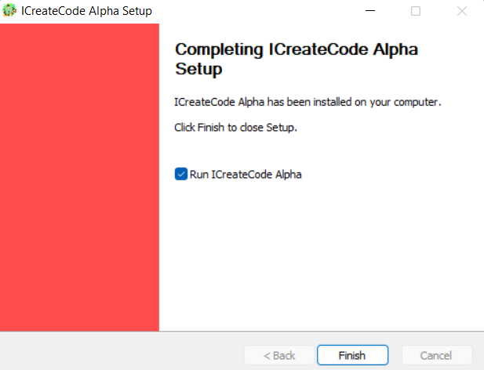
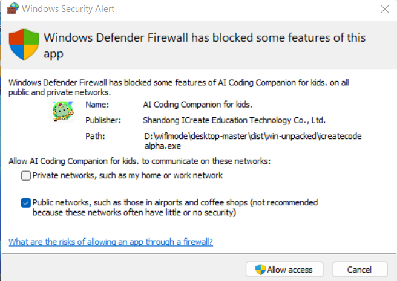
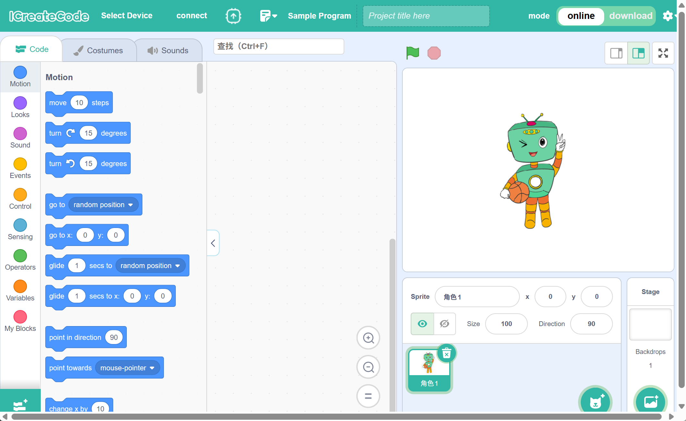
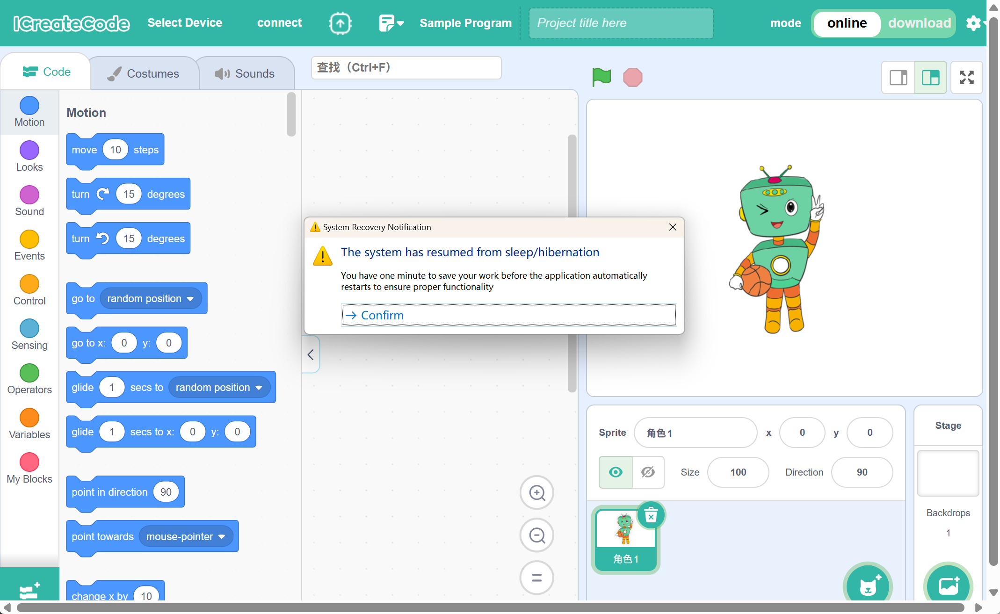

# Software Download & Installation Guide
## Overview  
ICreateCode is a graphical programming software independently developed by ICreateRobot. It works with multiple products such as the ICRobot, ICBricks, and micro:bit, enabling interactive projects that combine hardware and software.

## System Requirements
ICreateCode supports both **macOS** and **Windows**.

**Note:** For Windows, a **64-bit** system is required, Windows 10 or later.

## Download
Download the software from the official[ ICreateRobot ](https://www.icrobot.com/www/cn/index.html#/file/index?type2=ICRobot)website.

## Installation
Locate the downloaded installer package, then double-click it.

<!-- 这是一张图片，ocr 内容为： -->

When the installation window appears, click “我同意”（I Agree) to accept the license agreement.

<!-- 这是一张图片，ocr 内容为： -->

By default, select “Install for me only”, then click Next.

Note: You will be prompted to choose whether to install the software for the current user only or for all users on the computer. The difference is as follows:

    1. This option installs the software for the current user account only. After installation, only this user can access and use the software.
    2. This option installs the software for all user accounts on the computer. Any user on this device will be able to run the software.<!-- 这是一张图片，ocr 内容为： -->

Choose installation path: It is recommended to install to Disk C. If C drive space is insufficient, click Browse to choose another drive.

Click Install and wait for the process to complete.

<!-- 这是一张图片，ocr 内容为： -->

Just wait for the installation to be complete.

<!-- 这是一张图片，ocr 内容为： -->

Click mouse to complete, and then the network access permission will pop up. **Be sure to select Allow.**

<!-- 这是一张图片，ocr 内容为： -->

<!-- 这是一张图片，ocr 内容为： -->

The software is installed.

<!-- 这是一张图片，ocr 内容为： -->

## Notes
<!-- 这是一张图片，ocr 内容为： -->

To ensure the software functions properly:

+ If the computer goes into sleep mode and then wakes up, the software will start a 1-minute countdown to save your project.
+ After that, the software will restart automatically.

