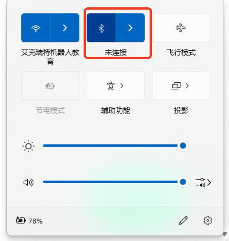
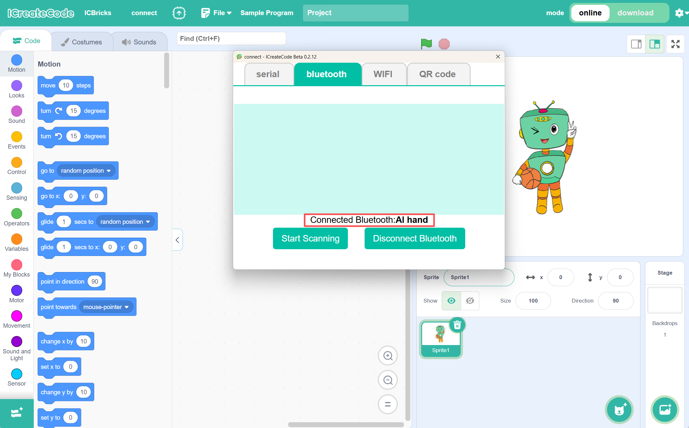
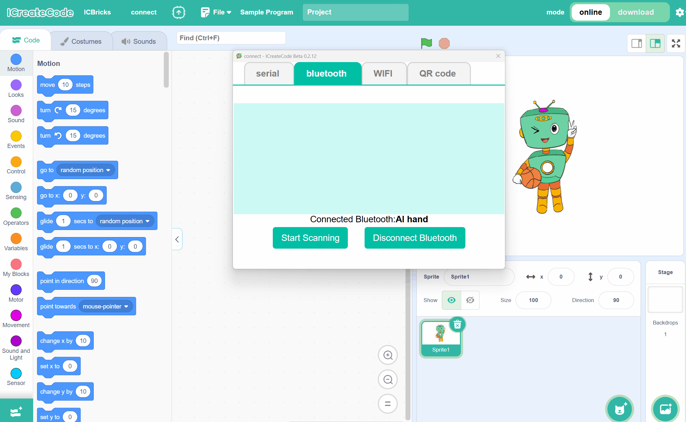

# Bluetooth Connection
## Establish Bluetooth connection
The software mode is divided into Interactive Mode and Download Mode, both of which require a Bluetooth connection to function.

Requirements:

● The computer must have Bluetooth functionality.

● ICBricks main controller.

### Steps
| <!-- 这是一张图片，ocr 内容为： -->
 | <!-- 这是一张图片，ocr 内容为： -->
 |
| --- | --- |
| Step 1: Turn on Bluetooth on the computer. Turn on Bluetooth on the main controller. | Step 2: In the programming software, click "Connect," select the ICBricks main controller, and do not close the connection window. In the connection window, select Bluetooth connection and choose the device name you wish to connect to. If no device is found, select "Start Scanning." |
| <!-- 这是一张图片，ocr 内容为： -->
 | <!-- 这是一张图片，ocr 内容为： -->
 |
| Step 3: Once the connection is complete, the software will display the currently connected device. | Note: If the connection window is closed, you can reopen it by clicking "connect" in the toolbar. |

