# User's Guide
## Online Mode (Interactive Mode）
### User Manual  
In Interactive Mode, ICBricks and the PC can establish wireless communication via low-energy Bluetooth, allowing you to control the main controller through programming.

_Note: The minimum firmware version for the main controller is V3.3.5._

### Steps
| <!-- 这是一张图片，ocr 内容为： -->
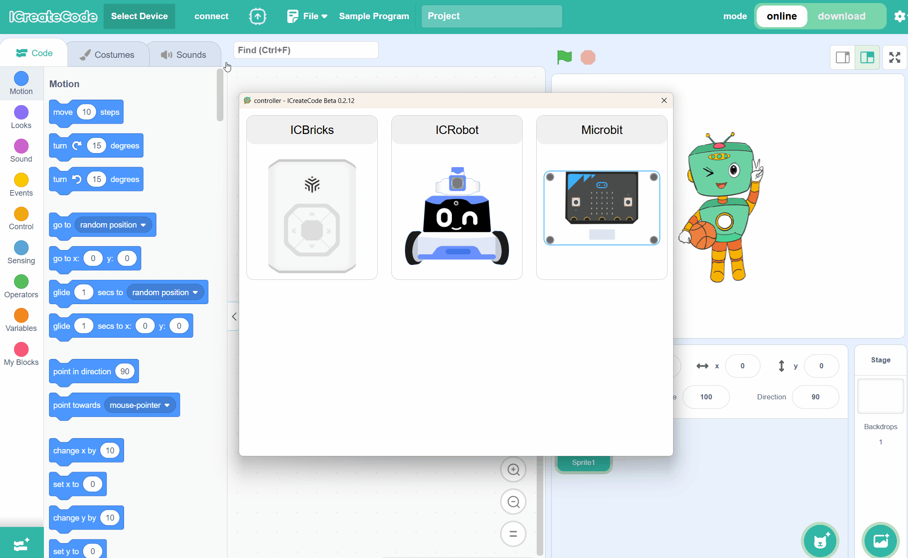 | <!-- 这是一张图片，ocr 内容为： -->
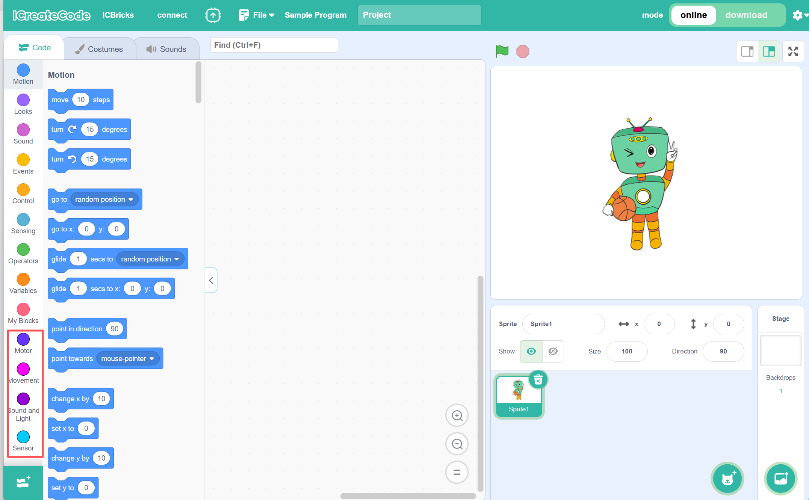 |
| --- | --- |
| Step 1: After turning on the ICBricks main controller and opening the programming software, select "Online Mode," then choose the device and Bluetooth connection method to establish the connection. | Step 2: Once the connection is successful, the block command area will automatically load the relevant ICBricks extension commands. |
| <!-- 这是一张图片，ocr 内容为： -->
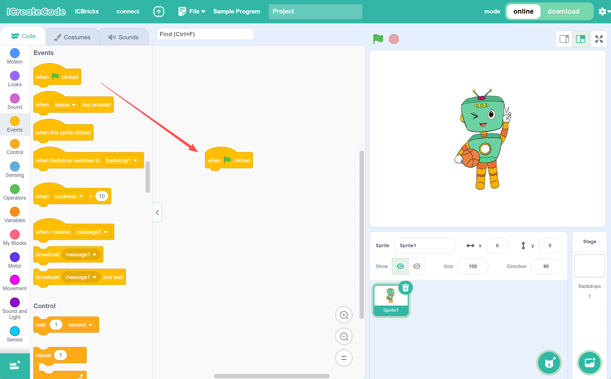 | <!-- 这是一张图片，ocr 内容为： -->
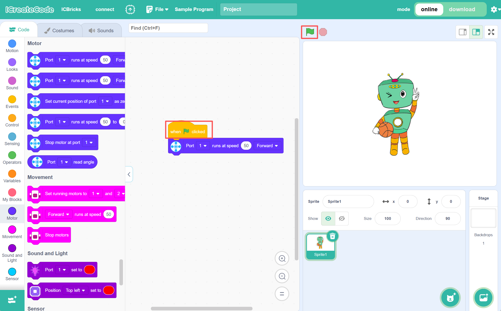 |
| Step 3: Drag the commands into the programming area to start programming. | Step 4: After completing the programming, click the green flag to execute the program and check the execution results. |

### Example
#### **Operation Steps**:  
| <!-- 这是一张图片，ocr 内容为： -->
 | <!-- 这是一张图片，ocr 内容为： -->
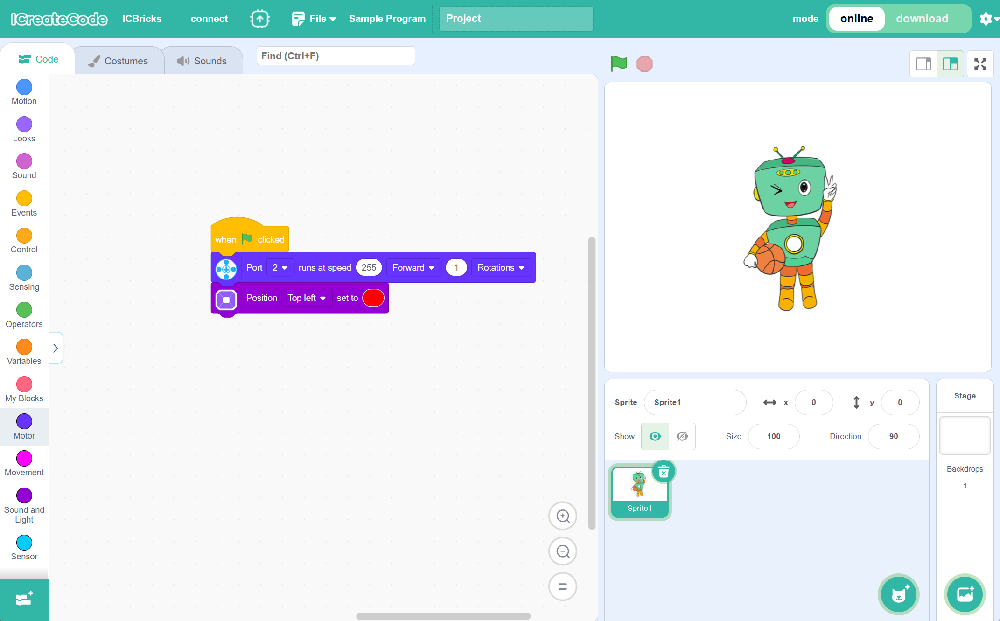 |
| --- | --- |
| Step 1: After turning on the ICBricks main controller and opening the programming software, select "Online Mode," then choose the device and Bluetooth connection method to establish the connection. | Step 2: Drag the commands into the programming area to start programming. |
| <!-- 这是一张图片，ocr 内容为： -->
  | |
| Step 3: After completing the programming, click the green flag to execute the program and check the execution results. | |

#### Demonstration  
<!-- 这是一张图片，ocr 内容为： -->
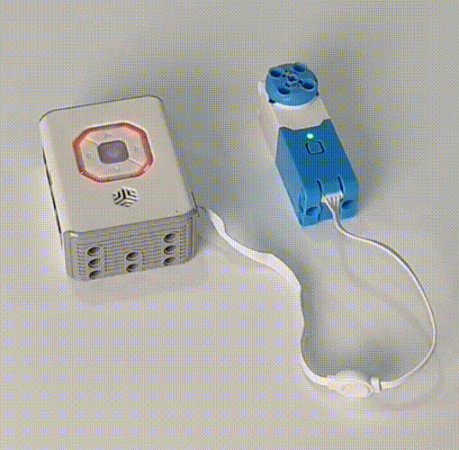

## Download Mode
### User Manual
In Download Mode, you can download the program you've written to the main controller. The program will control the main controller according to its content.

### **Operation Steps**:  
| <!-- 这是一张图片，ocr 内容为： -->
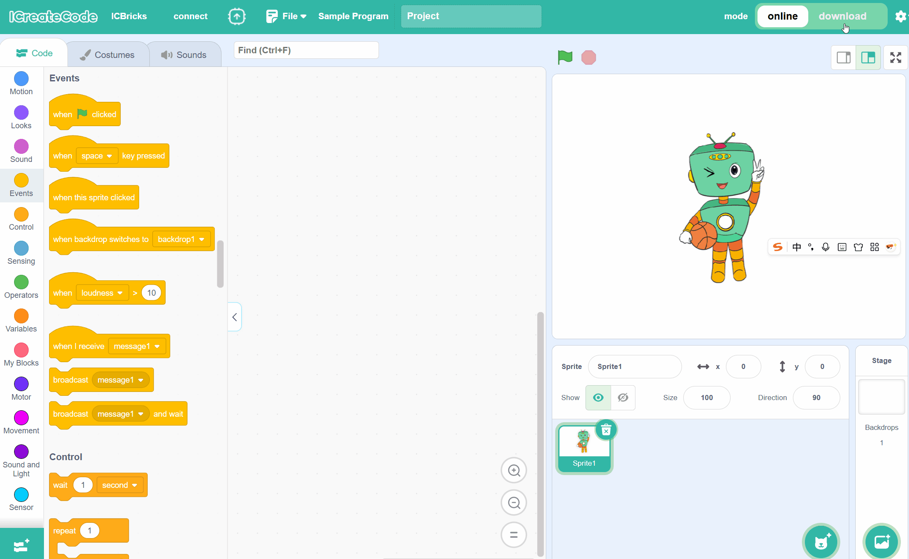 | <!-- 这是一张图片，ocr 内容为： -->
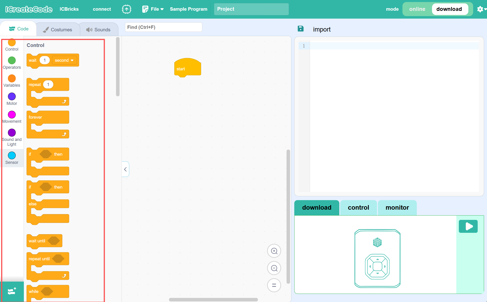 |
| --- | --- |
| Step 1: After turning on the ICBricks main controller and opening the programming software, select "Download Mode," then choose the device and Bluetooth connection method to establish the connection. | Step 2: Once the connection is successful, the block command area will automatically load the relevant ICBricks extension commands. |
| <!-- 这是一张图片，ocr 内容为： -->
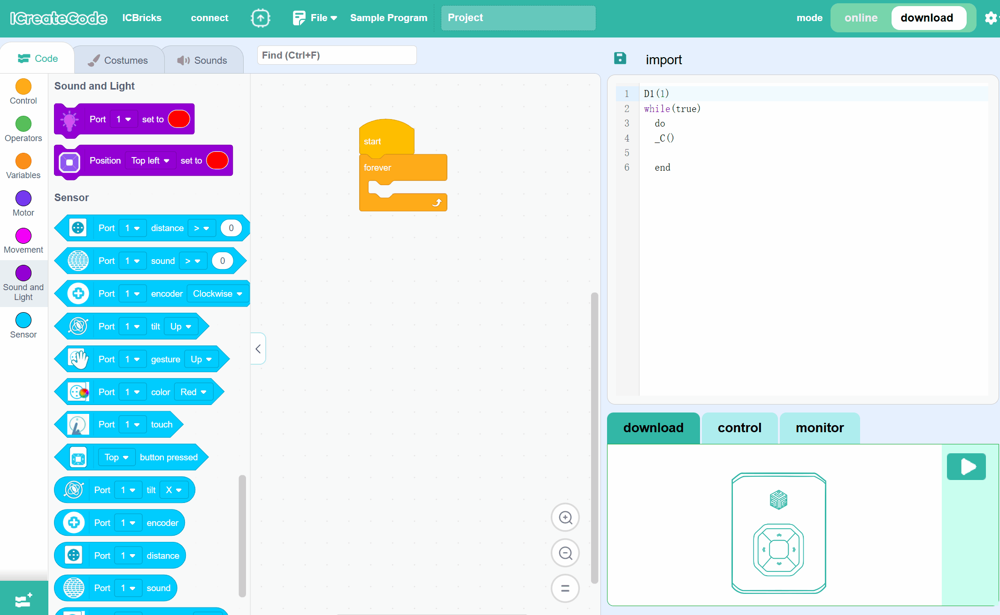 | <!-- 这是一张图片，ocr 内容为： -->
 |
| Step 3: Drag the command blocks into the programming area to start programming. While dragging the command blocks, the code area will display the corresponding Lua statements for the block commands. | Step 4: After completing the programming, click the hardware control button to upload the program to the main controller and execute it. |
| <!-- 这是一张图片，ocr 内容为： -->
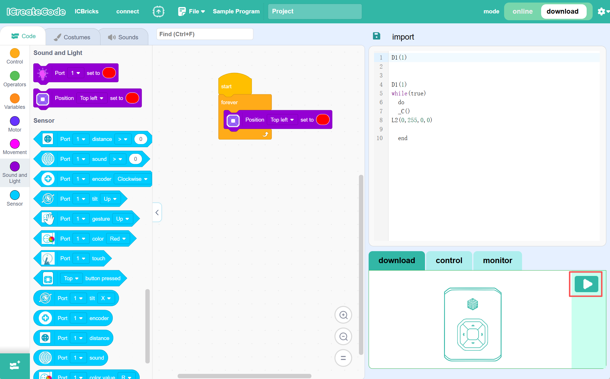 | <!-- 这是一张图片，ocr 内容为： -->
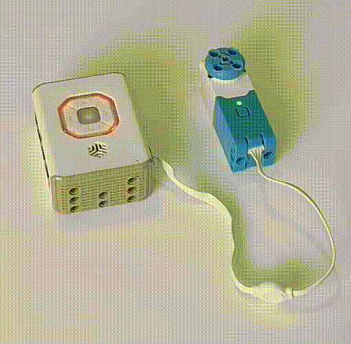 |
| Step 5: Once the download is complete, click the "Run" button in the hardware control area to start the program saved on the ICBricks main controller. Software Run Button Functions: + When no program is running: Pressing this button will start the program. + When the program is running: Pressing this button will stop the program. | Step 6: After running the program, the light in the middle of the ICBricks main controller will flash orange. Function of the Button in the Middle of the ICBricks Main Controller: + If no program is running: Pressing this button three times in quick succession will stop the program. + If the program is running: Pressing this button three times in quick succession will also stop the program. |

#### Demonstration  
<!-- 这是一张图片，ocr 内容为： -->

