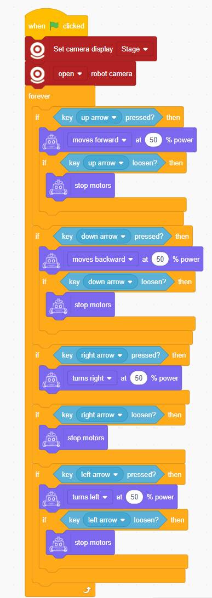

# Instructions
## Programming Overview
When programming the robot, the ICRobot communicates and interacts with the ICreateCode programming software through a selected connection method.

## Connection Methods
The ICRobot can connect to the ICreateCode software in four ways: Serial Port Mode, Bluetooth Mode, Wireless Access Point (AP) Mode, and Client (STA) Mode.

For details, refer to Serial Port Connection Mode, Bluetooth Connection Mode, Wireless Access Point (AP) Mode, and Client (STA) Mode.

## Programming Modes
During programming, you can operate in either Online Mode or Download Mode.

For step-by-step instructions, please refer to the user guide for Online Mode and Download Mode.

## Example Program: Button-Controlled Robot
Program Description: Control the robot using directional buttons, with a first-person view displayed on the stage.

### Program
<!-- 这是一张图片，ocr 内容为： -->

### Demonstration
<!-- 这是一张图片，ocr 内容为： -->

