# Users's Guide
## Online Mode (Interactive Mode）
### Usage Introduction
In Online Mode, the ICRobot can communicate with the PC via Serial Port, Bluetooth, AP, or STA, allowing you to program and control the robot to perform actions.

### Steps
| <!-- 这是一张图片，ocr 内容为： -->
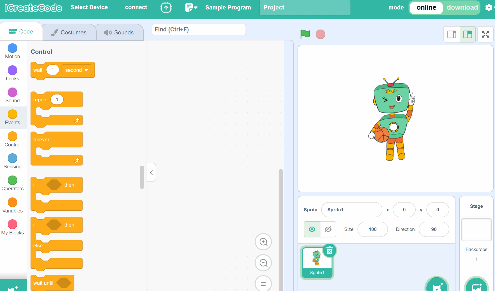 | <!-- 这是一张图片，ocr 内容为： -->
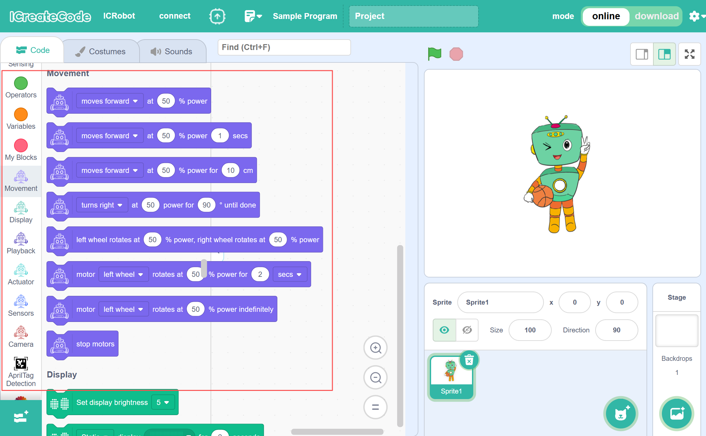 |
| --- | --- |
| Step 1. After both the ICRobot and the programming software are powered on, switch the software mode to Online Mode. Then select the device and the connection method. (For connection options and detailed steps, refer to Serial Port Connection Mode, Bluetooth Connection Mode, Wireless Access Point (AP) Mode, and Client (STA) Mode.) | Step 2. Once the selection is successful, the Block Commands panel will automatically load the ICRobot-related extension blocks. |
| <!-- 这是一张图片，ocr 内容为： -->
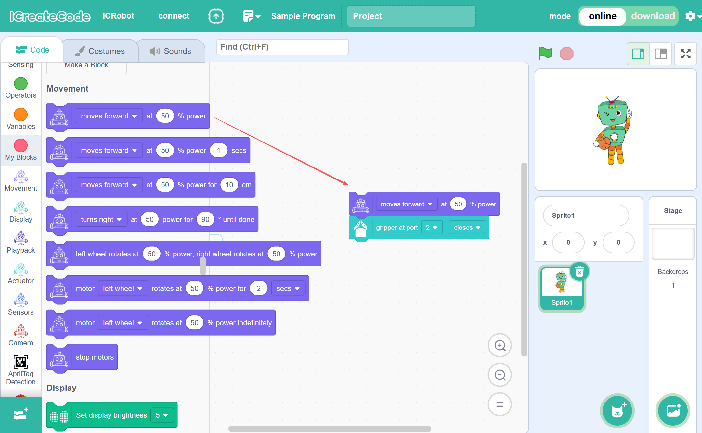 | <!-- 这是一张图片，ocr 内容为： -->
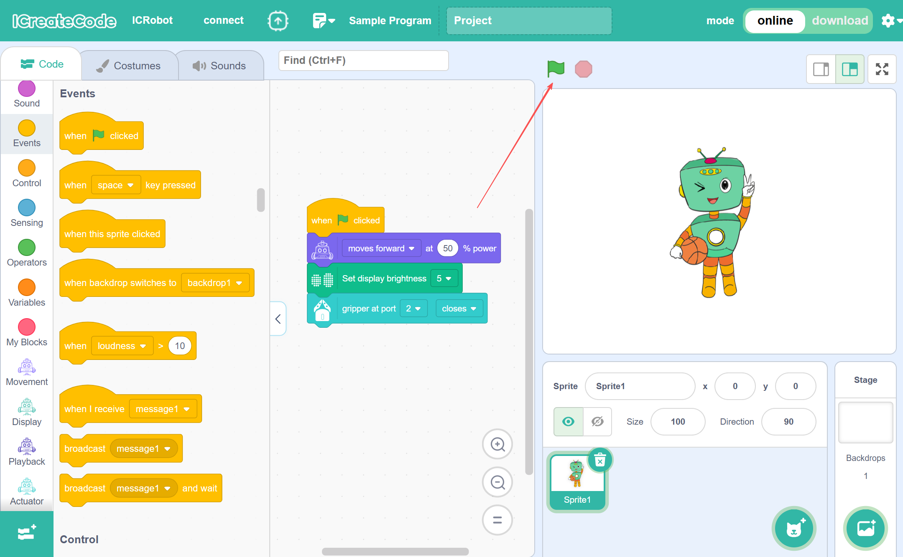 |
| Step 3.  Drag the required blocks into the Coding Area to create your program. | Step 4. After programming is complete, click the green flag to execute the program and observe the result. |

### Example
#### Scenario
Using AP mode, ICRobot connects to the PC and moves forward at full power for 1 second, then activates its robotic gripper once.

#### Preparation
| <!-- 这是一张图片，ocr 内容为： -->
 | <!-- 这是一张图片，ocr 内容为： -->
 | <!-- 这是一张图片，ocr 内容为： -->
 |
| :---: | :---: | :---: |
| A computer (Windows/macOS) | ICreate Code | ICRobot |

#### Steps
| <!-- 这是一张图片，ocr 内容为： -->
 | <!-- 这是一张图片，ocr 内容为： -->
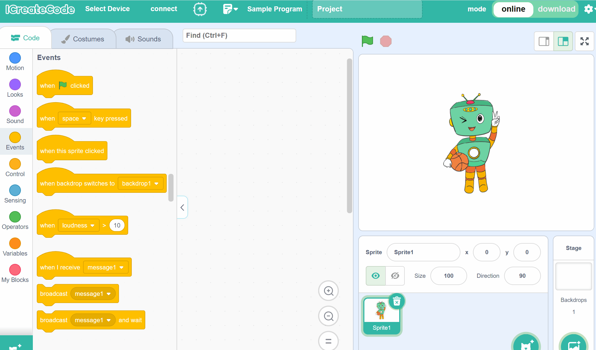 |
| --- | --- |
| Step 1. Power on ICRobot and switch to AP mode via the SET menu. | Step 2. Open the programming software ICreate Code. Check the ICRobot’s Wi-Fi name (SSID) in your system WLAN/Wi-Fi list in advance, then select AP as the connection method in the software to connect. |
| <!-- 这是一张图片，ocr 内容为： -->
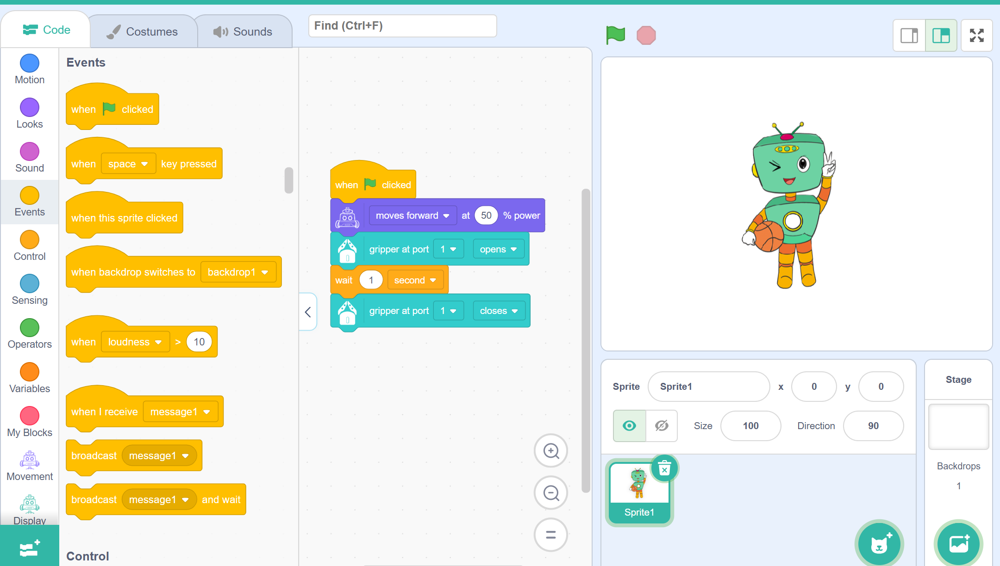 | <!-- 这是一张图片，ocr 内容为： -->
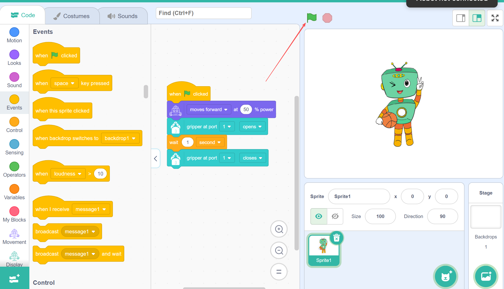 |
| Step 3. After the connection is successful, program the target content.   | Step 4. Click the green flag to run the program and observe the results. |

#### Demonstration
<!-- 这是一张图片，ocr 内容为： -->

## Download Mode
### Usage Introduction
The programming content can be downloaded to the ICRobot and executed on the robot. The download steps are as follows:

1. In the software, confirm the target download slot/location for the program.
2. Download the program to the built-in program storage of Robot Car 1–5.
3. Based on the program content, control the robot to execute the corresponding action commands.

### Steps
| <!-- 这是一张图片，ocr 内容为： -->
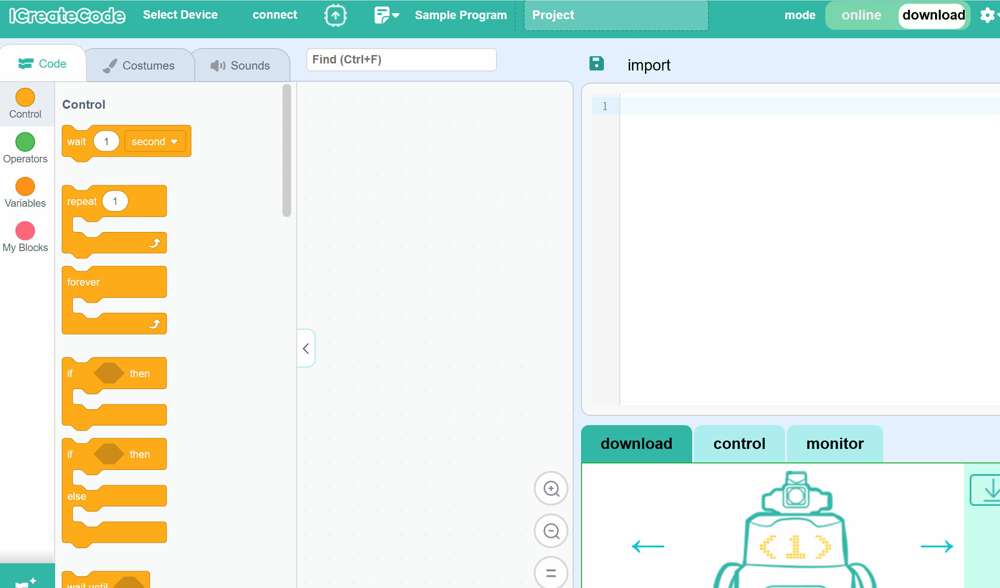 | <!-- 这是一张图片，ocr 内容为： -->
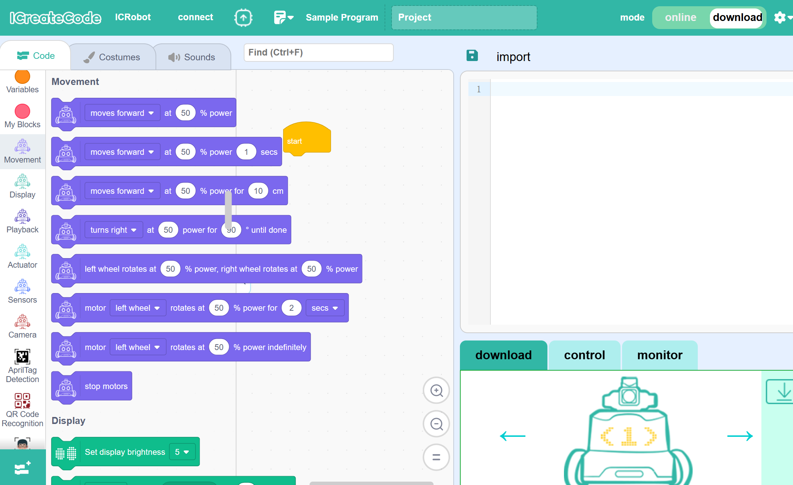 |
| --- | --- |
| Step 1. After both the ICRobot and the programming software are powered on, switch the software mode to Interactive Mode. Then select the device and the connection method. (For connection options and detailed steps, refer to Serial Port Connection Mode, Bluetooth Connection Mode, Wireless Access Point (AP) Mode, and Client (STA) Mode.)   | Step 2. Once the selection is successful, the Block Commands panel will automatically load the ICRobot-related extension blocks. |
| <!-- 这是一张图片，ocr 内容为： -->
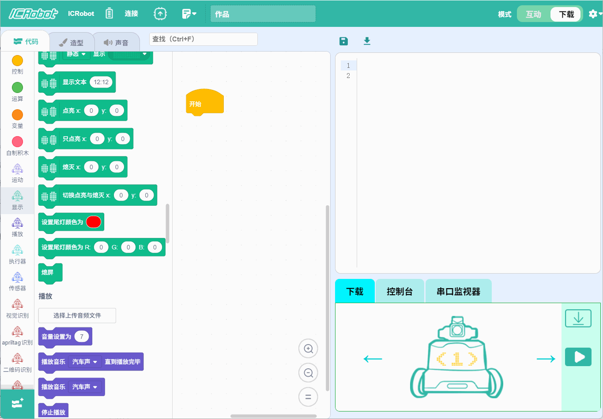 | <!-- 这是一张图片，ocr 内容为： -->
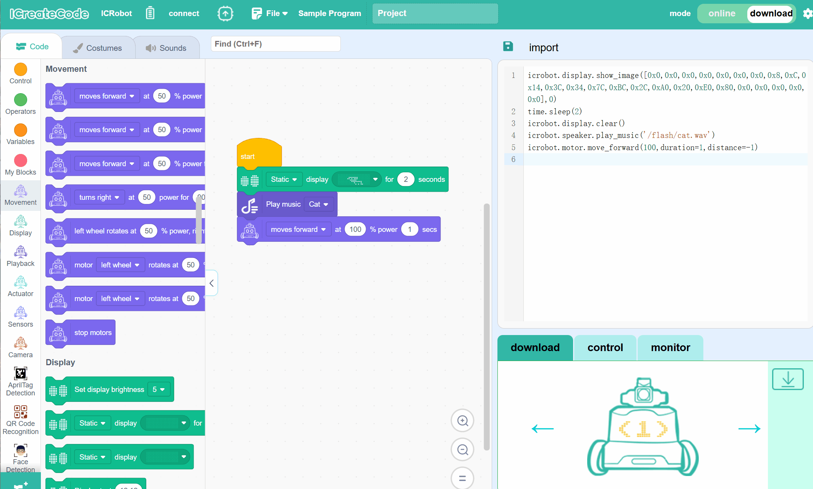 |
| Step 3. Drag the command blocks into the Coding Area to create the program. While dragging the blocks, the Python Coding Area will display the corresponding Python code for each block. | Step 4. After completing the programming, click the Download option in the Hardware Control Panel to download the programmed content to the ICRobot’s built-in program storage (with 5 available slots: 1–5). |

### Example
#### Scenario
The ICRobot connects to the PC via STA Mode, making the robot move forward at maximum power for 1 second. After that, the display shows the custom dot matrix effect. The program content is downloaded to the built-in program storage at position 3.

#### 准备
| <!-- 这是一张图片，ocr 内容为： -->
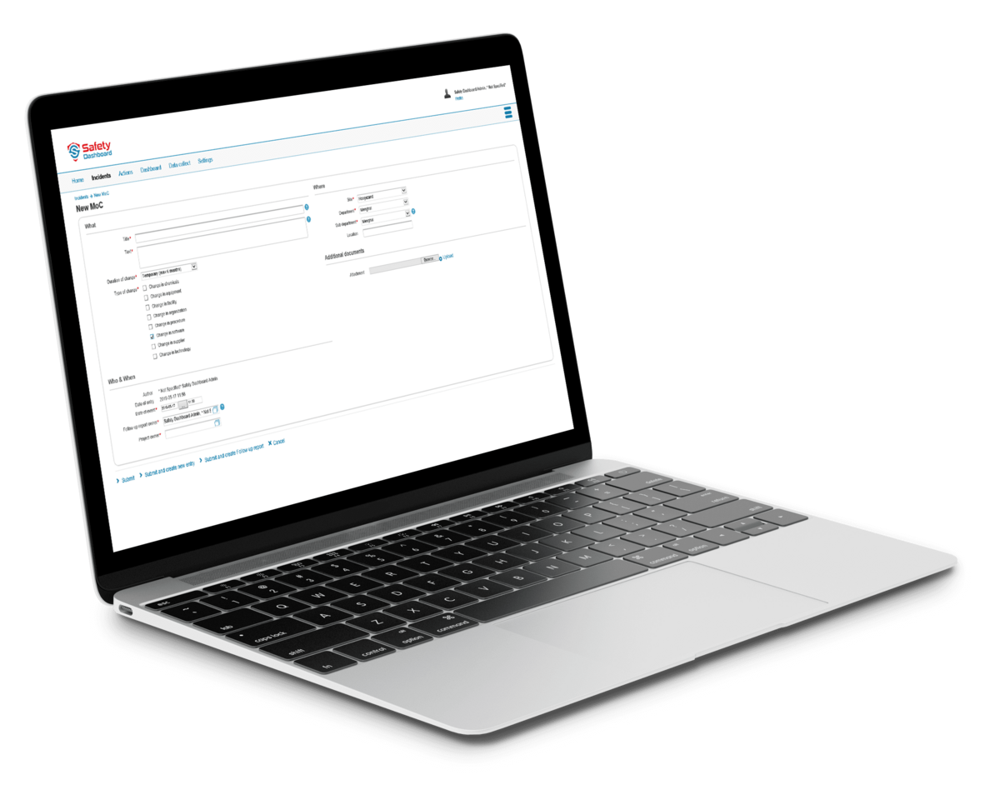 | <!-- 这是一张图片，ocr 内容为： -->
 | <!-- 这是一张图片，ocr 内容为： -->
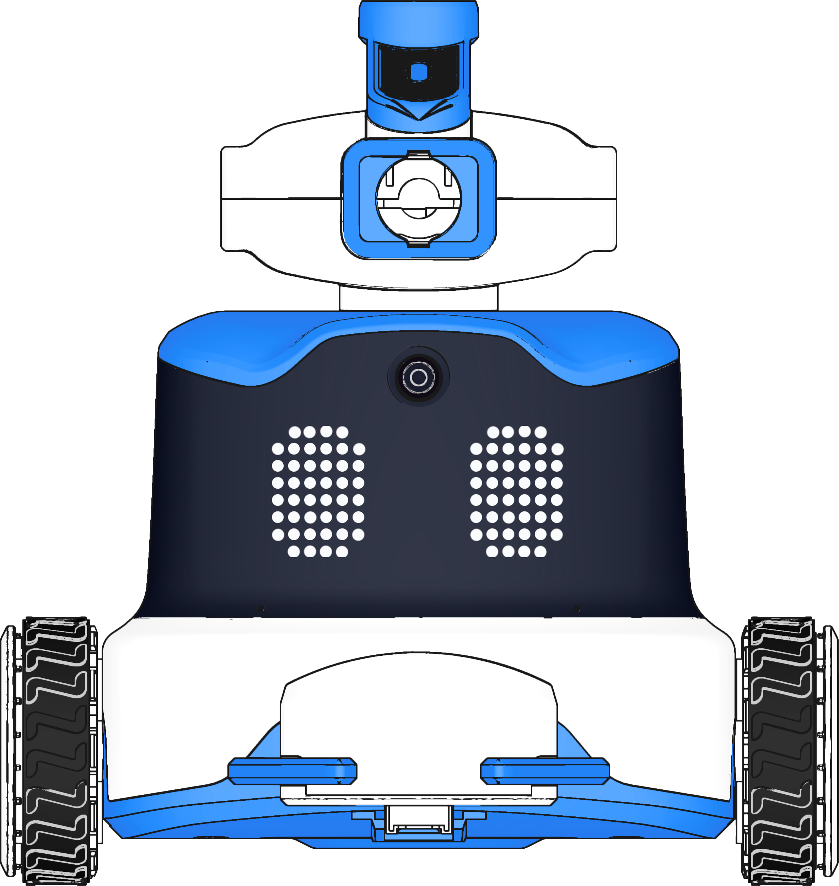 |
| :---: | :---: | :---: |
| A computer (Windows/macOS) | ICreate Code | ICRobot |

#### Steps
| <!-- 这是一张图片，ocr 内容为： -->
 | <!-- 这是一张图片，ocr 内容为： -->
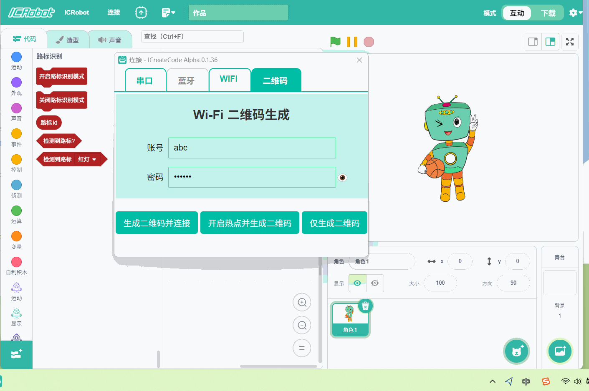 |
| --- | --- |
| Step 1. Power on ICRobot. Switch to SET Mode, then select STA Mode. | Step 2. Open the programming software ICreate Code, and select the STA connection method in the software to establish the connection. A corresponding QR code will be generated. |
| <!-- 这是一张图片，ocr 内容为： -->
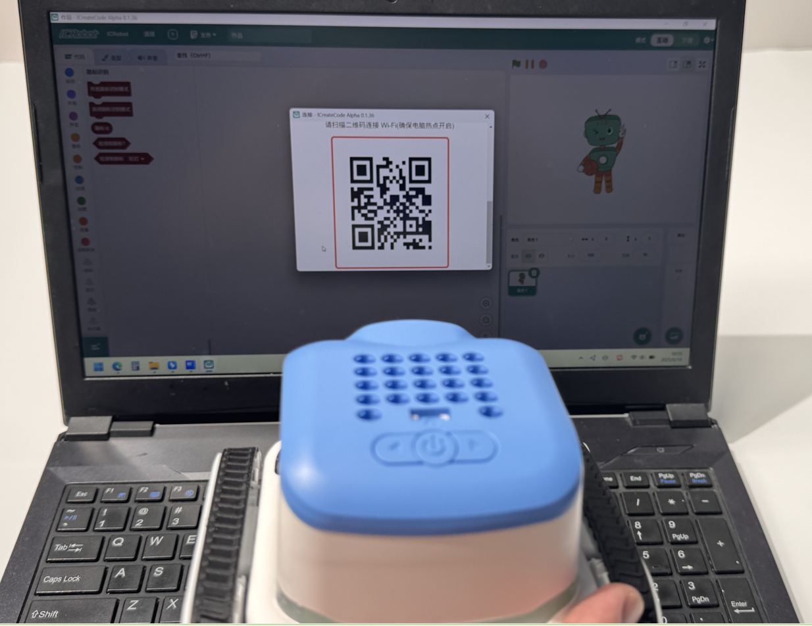 | <!-- 这是一张图片，ocr 内容为： -->
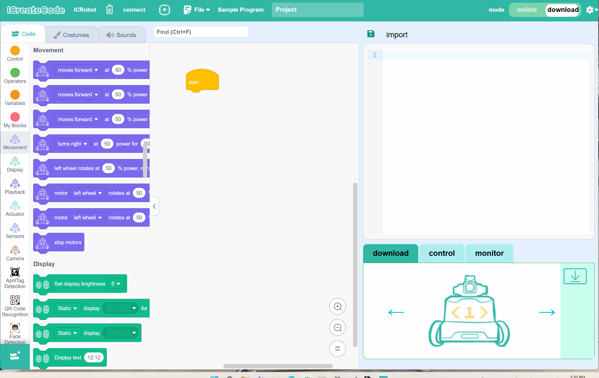 |
| Step 3. Point the ICRobot camera at the QR code on the screen to scan and connect. Once connected, a message will appear saying "Connection Successful" and the page will display "Socket Connection Successful", indicating the device has successfully connected. | Step 4. After a successful connection, proceed to program the target content. |
| <!-- 这是一张图片，ocr 内容为： -->
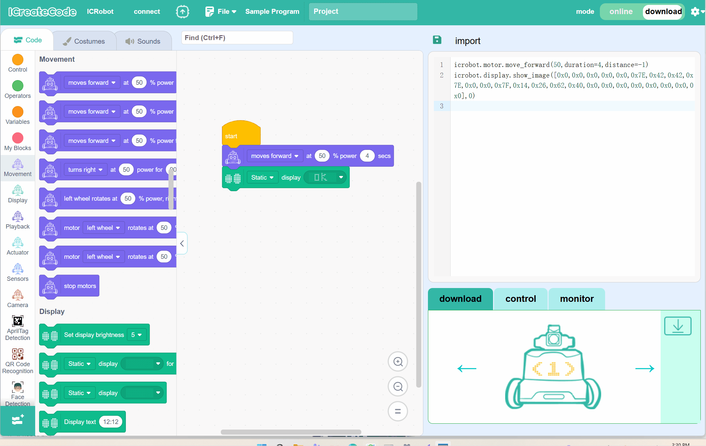 | <!-- 这是一张图片，ocr 内容为： -->
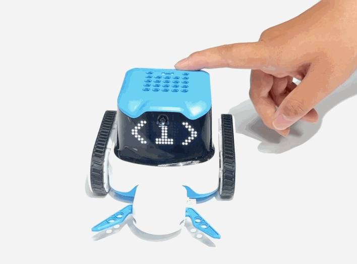 |
| Step 5. After selecting position 3, click Download. Once the download is complete, a message will appear saying "Download Successful". | Step 6. After selecting position 3, click Download. Once the download is complete, a message will appear saying "Download Successful". |

#### 效果展示
<!-- 这是一张图片，ocr 内容为： -->
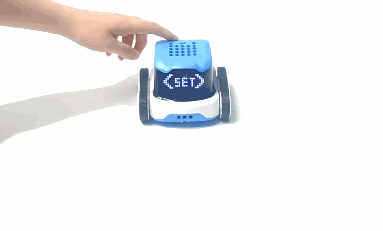

