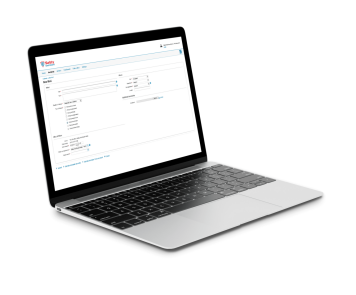
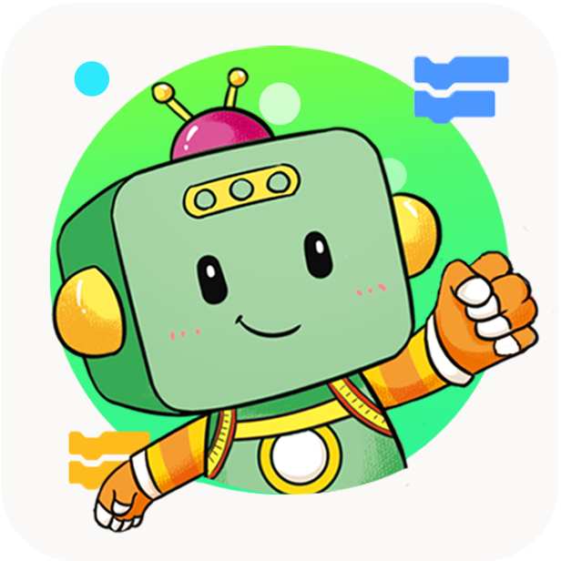
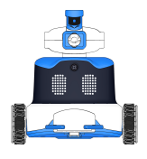
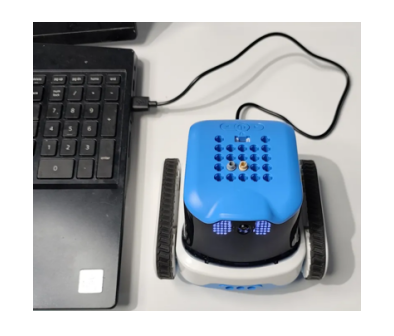

# Serial Connection
## Preparation
|  |  |  |  |
| :---: | :---: | :---: | :---: |
| A computer (Windows/macOS) | ICreateCode | ICRobot | USB-C Cable |

## Steps
|  |  |
| :---: | :---: |
| Step 1. After powering on the robot, connect the robot to the computer using a USB-C data cable.   | Step 2. Open the programming software on the computer, click "Select Device", and choose ICRobot. |
|  | |
| Step 3. In the "Serial" option, select the correct port number, then click "Connect". | |

