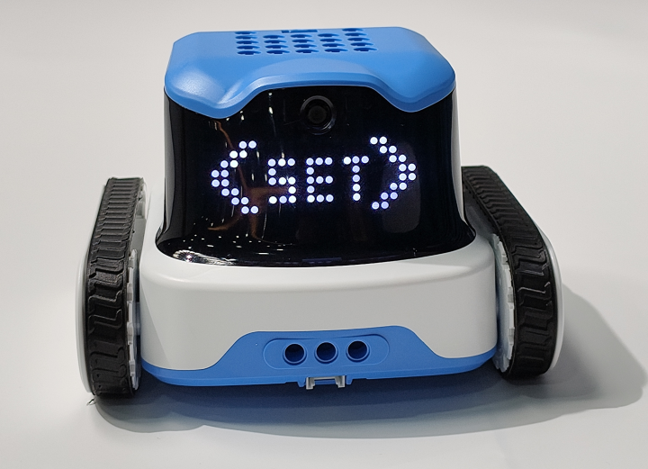
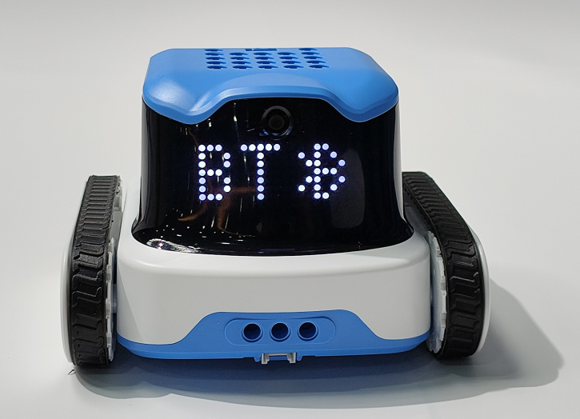
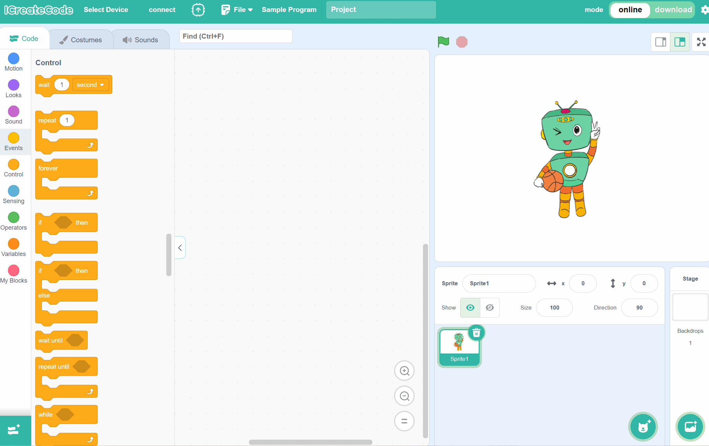
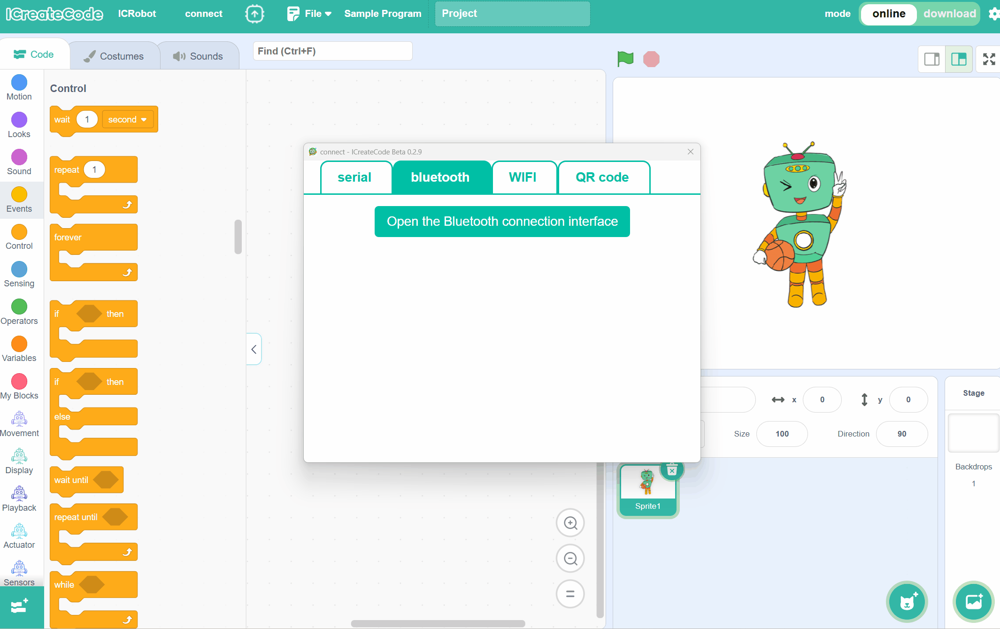
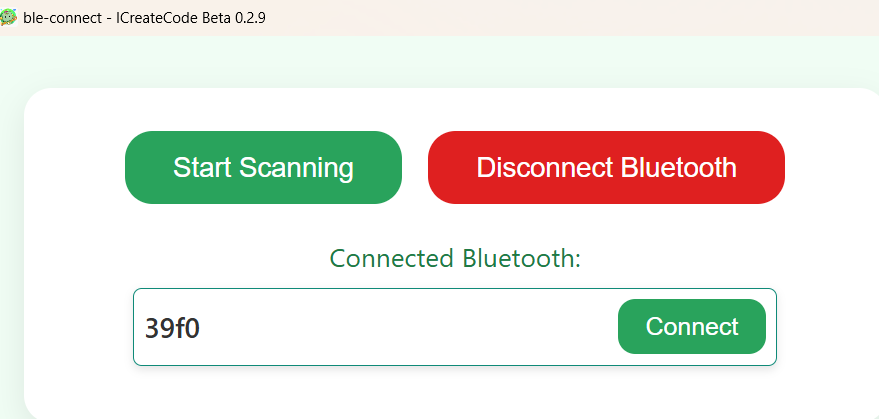

# Bluetooth Mode (BT Mode)
<!-- 这是一张图片，ocr 内容为： -->

## Preparation
| <!-- 这是一张图片，ocr 内容为： -->
![]IMG/B2.png) | <!-- 这是一张图片，ocr 内容为： -->
 | <!-- 这是一张图片，ocr 内容为： -->
 |
| :---: | :---: | :---: |
| A computer (Windows/macOS) | ICreateCode | ICRobot |

## Steps
__**Note:**_ Ensure that Bluetooth is enabled on the computer system.  _

| <!-- 这是一张图片，ocr 内容为： -->
 | <!-- 这是一张图片，ocr 内容为： -->
 |
| --- | --- |
| Step 1. Power on the robot, and use the left button to switch the robot’s status. When the screen displays <SET>, press the middle button to confirm and enter the setup mode. | Step 2. In the menu, use the left and right buttons to select the connection mode. Find BT, then press the middle button to confirm and switch to BT connection mode. |
| <!-- 这是一张图片，ocr 内容为： -->
 | <!-- 这是一张图片，ocr 内容为： -->
 |
| Step 3. No manual operation is required; the ICRobot will announce the following: "Switching to Bluetooth mode," and then it will wait for the switch. Or "Already in Bluetooth mode, no switch needed," in which case no waiting is necessary, and you can use it immediately. | Step 4. Open the programming software on the computer, click "Select Device", and choose ICRobot. |
| <!-- 这是一张图片，ocr 内容为： -->
 | <!-- 这是一张图片，ocr 内容为： -->
 |
| Step 5. Select the Bluetooth connection method, click "Bluetooth", and then click "Start Scanning". From the refreshed Bluetooth list, select the device name to connect. The device's Bluetooth name is the last 4 digits of the MAC address. | Once the connection is successful, the programming software will display the connection interface, and the robot will announce "Bluetooth connection successful." |

__

