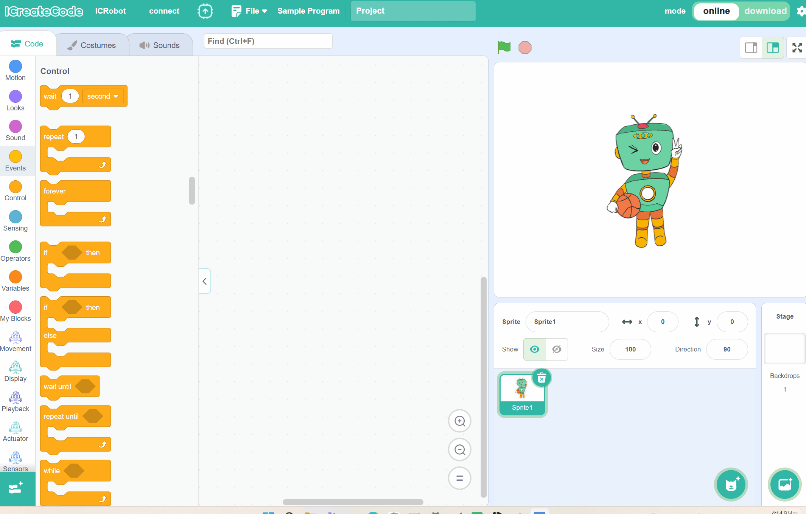
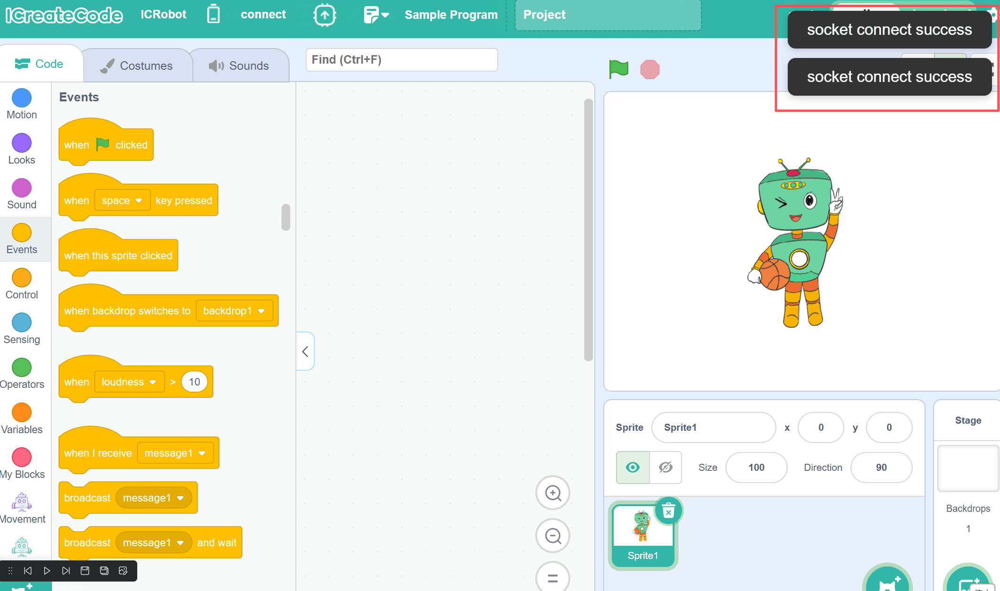

# Access Point Mode (AP Mode)
## Definition
<!-- 这是一张图片，ocr 内容为： -->

In AP Mode, the ICRobot acts as a wireless hotspot. The PC searches for and connects to the robot’s Wi-Fi signal to enable wireless communication.

## Preparation
| <!-- 这是一张图片，ocr 内容为： -->
 | <!-- 这是一张图片，ocr 内容为： -->
 | <!-- 这是一张图片，ocr 内容为： -->
 |
| :---: | :---: | :---: |
| A computer (Windows/macOS) | ICreateCode | ICRobot |

## Steps
| <!-- 这是一张图片，ocr 内容为： -->
 | <!-- 这是一张图片，ocr 内容为： -->
 |
| --- | --- |
| Step 1. Power on the ICRobot. After startup, press the left or right button to switch to SET Mode. | Step 2. In SET mode, use the left button or right button to switch to AP mode, then press the power button. After pressing the button, the robot will announce "Switching to AP mode" or "Already in AP mode, no switch needed". |
| <!-- 这是一张图片，ocr 内容为： -->
 | <!-- 这是一张图片，ocr 内容为： -->
 |
| Step 3. In the programming software interface, click Connect, select WIFI, then choose the ICRobot device name (last 4 digits of the MAC address), and click Connect. Note: The MAC address can be found on the label at the bottom of the robot. | Step 4. If the device name does not appear in Step 3, open WLAN on the PC and refresh the search for the robot’s device name (the device name is the last 4 digits of the MAC address). Note: Only check the device name; do not click Connect. |
| <!-- 这是一张图片，ocr 内容为： -->
 | <!-- 这是一张图片，ocr 内容为： -->
 |
| Step 5. When the software displays "Socket connection successful", the ICRobot screen will switch to a cat emoji and announce "Connection successful". This indicates a successful connection. Note: After the ICRobot connects to the PC via AP mode, the PC’s wireless network will automatically disconnect. | |

Note: If you need to disconnect, simply click "Disconnect Current Connection" in the text box on the software interface.

