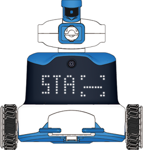
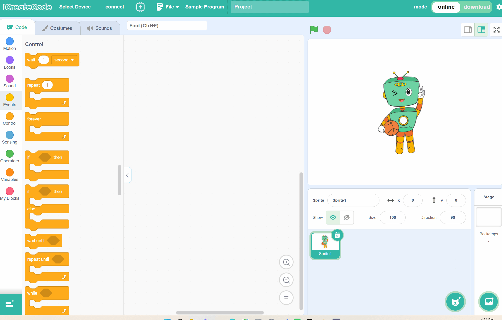

# Station Mode (STA)
## Definition
<!-- 这是一张图片，ocr 内容为： -->

In STA Mode, the ICRobot connects to the computer’s mobile hotspot for wireless communication.

## Preparation
| <!-- 这是一张图片，ocr 内容为： -->
 | <!-- 这是一张图片，ocr 内容为： -->
 | <!-- 这是一张图片，ocr 内容为： -->
 |
| :---: | :---: | :---: |
| A computer (Windows) | ICreateCode | ICRobot |

## Steps
| <!-- 这是一张图片，ocr 内容为： -->
 | <!-- 这是一张图片，ocr 内容为： -->
 |
| --- | --- |
| Step 1. After powering on, use the left button or right button to switch to SET mode, then press the power button to enter.   | Step 2. After switching to STA mode using the left button or right button, press the power button. At this point, the robot will announce "Switching to STA mode" or "Already in STA mode, no switch needed." |
| <!-- 这是一张图片，ocr 内容为： -->
 | <!-- 这是一张图片，ocr 内容为： -->
 |
| Step 3. Open the programming software, click "Select Device", and choose "ICRobot". In the pop-up dialog box, select "QR Code". | Step 4. Open the computer's mobile hotspot, right-click on the hotspot and select "Settings" to view the device name and password. Enter the name and password into the QR code text box in the programming software, and click Generate to create the QR code for connection. Note: When enabling the hotspot, make sure the network frequency band is set to "2.4GHz", otherwise the connection may fail. |
| <!-- 这是一张图片，ocr 内容为： -->
 | <!-- 这是一张图片，ocr 内容为： -->
 |
| Step 5. Use the robot’s camera to scan the QR code generated by ICreateCode to complete the network configuration. | Step 6. The ICRobot display will switch to a cat interactive expression, and the robot will announce “Connection successful.” This indicates the connection has been successfully established. |

Note: If you need to disconnect, simply turn off the mobile hotspot on the computer.

