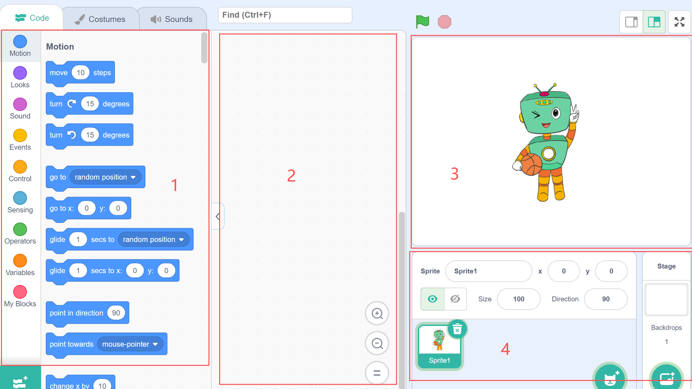
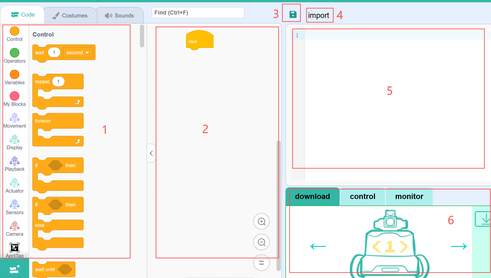

# Interface Guide
## Title Bar
<!-- 这是一张图片，ocr 内容为： -->

| No. | Name | Function Description |
| :---: | :---: | :---: |
| ① | Software Name | Displays the current software name and version number |

## Toolbar
<!-- 这是一张图片，ocr 内容为： -->

| No. | Name | Function Description |
| :---: | :---: | --- |
| ① | Select Device | Select the type of device you want to use, including ICBricks, ICRobot, and micro:bit. |
| ② | Connect | Select the connection method, including Serial Port, Bluetooth, Wi-Fi, and QR Code. |
| ③ | Firmware Burning | Select and flash different firmware versions, including the Standard Firmware and the Xiaozhi Firmware versions. |
| ④ | File | The drop-down menu provides three ways to open files: New Project, Open from Computer, and Save As. + Project files saved in Interactive Mode can only be uploaded and used in Interactive Mode. + Project files saved in Download Mode can only be uploaded and used in Download Mode. |
| ⑤ | Sample Program | Includes sample programs in SB3 and Python formats. After selecting any sample, the programming interface will automatically load the corresponding content. |
| ⑥ | Program | Rename the current project. |
| ⑦ | Mode | Switch between Online Interactive Mode and Download Mode. |
| ⑧ | Settings | Configure language and theme color settings. |

## Editing Interface
### Online Mode
<!-- 这是一张图片，ocr 内容为： -->

| No. | Name | Function Description |
| :---: | :---: | --- |
| ① | Block Commands | Used to select different categories of coding blocks and extensions. Block categories include: Motion, Looks, Sound, Control, Events, Sensing, Operators, Variables, and My Blocks. |
| ② | Coding Area | Drag block commands into this area to create and edit your program. |
| ③ | Stage Area | Displays the results/effects after the sprite has been programmed. |
| ④ | Character Area | Add/edit characters or background images for the stage |

### Download Mode
<!-- 这是一张图片，ocr 内容为： -->

| No. | Name | Function Description |
| :---: | :---: | --- |
| ① | Block Commands | Used to select different categories of coding blocks and extensions. Block categories include: Motion, Looks, Sound, Control, Events, Sensing, Operators, Variables, and My Blocks. |
| ② | Coding Area | Drag block commands into this area to create and edit your program. |
| ③ | Save | Save the current project locally. |
| ④ | Import | Import an existing local file with the **.py** extension into the current project. |
| ⑤ | Python Coding Area | Displays the Python code corresponding to the blocks on the left. You can add, delete, and edit the code here. |
| ⑥ | Hardware Control Panel | + Download: Upload the program to the ICRobot. + Control: When the ICRobot is connected to the computer, you can view the status of the 5-channel grayscale sensor, function buttons, and camera. + Serial Monitor: Used to receive and send serial data. |

