# ICRobot Block Guide
## Motion
### Robot (moves forward、moves backward、turns left、turns light) at ( ) % power
<!-- 这是一张图片，ocr 内容为： -->
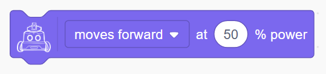

Controls the robot to move in the specified direction with the given power.

Example:

<!-- 这是一张图片，ocr 内容为： -->
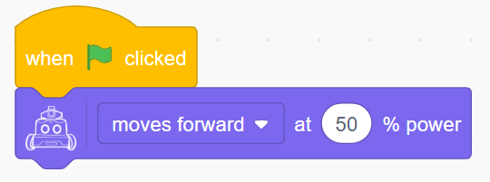

### Robot (moves forward、moves backward、turns left、turns light) at ( ) % power ( ) Seconds
<!-- 这是一张图片，ocr 内容为： -->
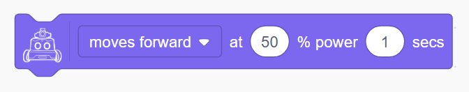

Controls the robot to move in the specified direction with a given power for a certain number of seconds. This is a blocking block.

Example:

<!-- 这是一张图片，ocr 内容为： -->
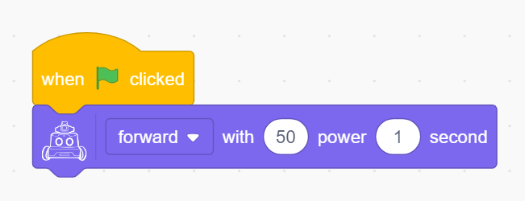

### Robot (moves forward、moves backward、turns left、turns light) at ( ) % power for ( ) cm
<!-- 这是一张图片，ocr 内容为： -->
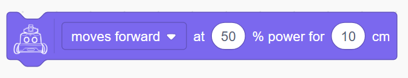

Controls the robot to move in the specified direction with a given power for a specified distance. This is a blocking block.

Example:

<!-- 这是一张图片，ocr 内容为： -->
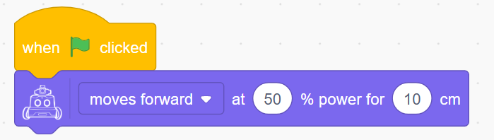

### Robot (turns left、turns light) at ( ) % power for () degrees until done
<!-- 这是一张图片，ocr 内容为： -->
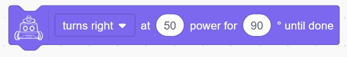

Controls the robot to turn left or right with the specified power until the target angle is reached. This is a blocking block.

Example:

<!-- 这是一张图片，ocr 内容为： -->
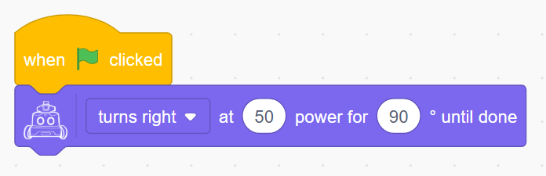

### Robot's left wheel rotates at ( ) % power, right wheel rotates at ( ) % power
<!-- 这是一张图片，ocr 内容为： -->
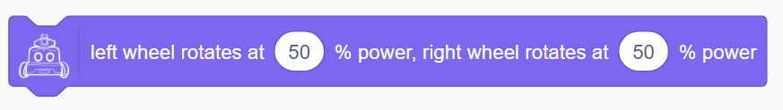

Independently control the power of the left and right wheels.

Example:

<!-- 这是一张图片，ocr 内容为： -->

### Robot's motor (left wheel / right wheel) with ( )% power for ( ) (Seconds / cm)
<!-- 这是一张图片，ocr 内容为： -->
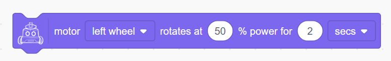

Controls a single wheel to move with the specified power for a given time or distance.

Example:

<!-- 这是一张图片，ocr 内容为： -->
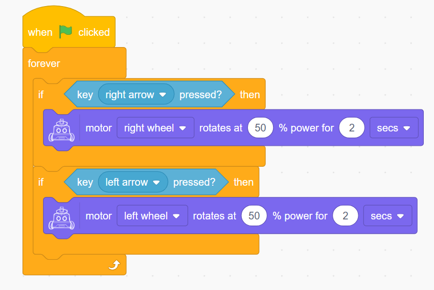

### Robot's motor (left wheel / right wheel) rotates at ( ) % power indefinitely
<!-- 这是一张图片，ocr 内容为： -->
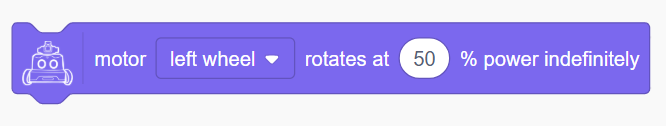

Continuously control a single wheel to move with the specified power.

Example:

<!-- 这是一张图片，ocr 内容为： -->
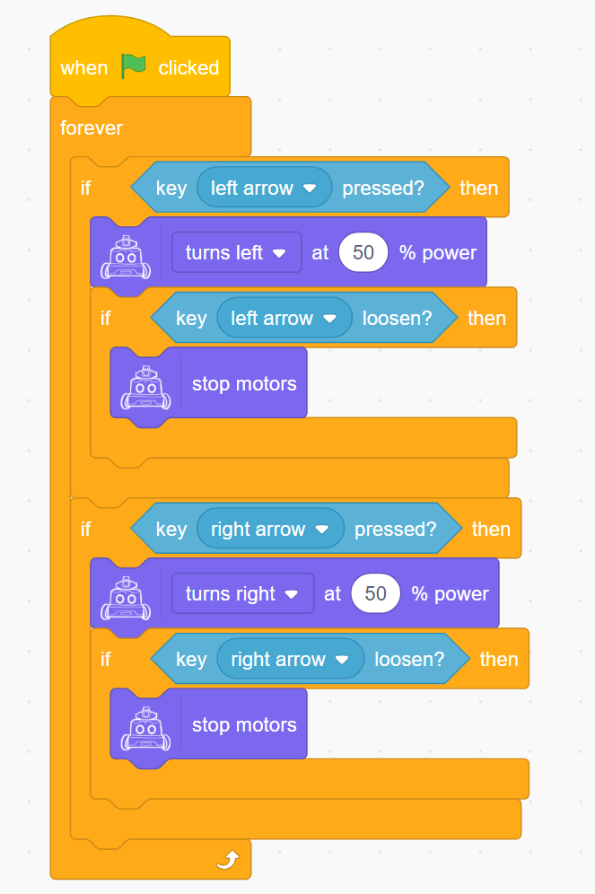

### Stop Movement
<!-- 这是一张图片，ocr 内容为： -->
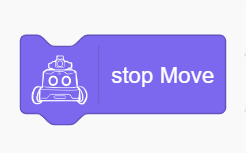

Stop the robot's motion.

## Display (Matrix LED)
### Set display brightness to (1–10)
<!-- 这是一张图片，ocr 内容为： -->
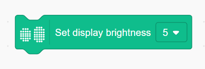

Set the display brightness of the robot's dot-matrix screen, the value is 1-10, the larger the value the brighter it is.

Example:

 <!-- 这是一张图片，ocr 内容为： -->
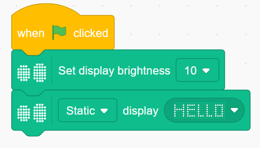

### (Static / Right to Left / Left to Right / Top to Bottom / Bottom to Top) Display () for () seconds
<!-- 这是一张图片，ocr 内容为： -->

Setting the static or dynamic display of the set dots for a given length of time

Example:

<!-- 这是一张图片，ocr 内容为： -->
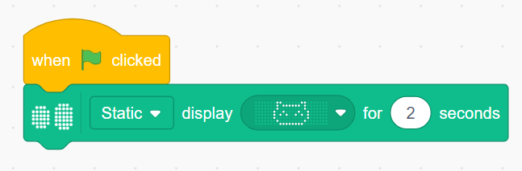

### (Static / Right to Left / Left to Right / Top to Bottom / Bottom to Top) Display ( )
<!-- 这是一张图片，ocr 内容为： -->

Set static or dynamic display of a given dot matrix all the time

Example:

<!-- 这是一张图片，ocr 内容为： -->
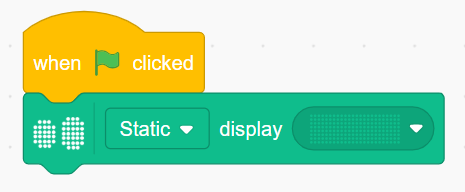

### Display Text ()
<!-- 这是一张图片，ocr 内容为： -->
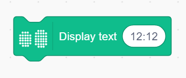

Display a text string on the matrix; if the string exceeds the matrix width, it scrolls; otherwise, it displays statically.

Example:

<!-- 这是一张图片，ocr 内容为： -->
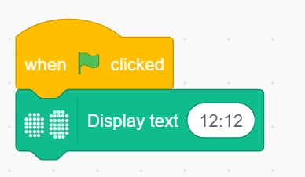

### Light up x() y()
<!-- 这是一张图片，ocr 内容为： -->

Turn on the LED at coordinate (x, y); (0, 0) is bottom-left.

Example:

<!-- 这是一张图片，ocr 内容为： -->
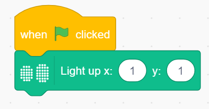

### Only light up x() y()
<!-- 这是一张图片，ocr 内容为： -->
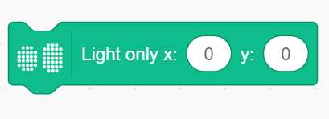

Light up only the LED at (x, y), turning off all others.

Example:

<!-- 这是一张图片，ocr 内容为： -->
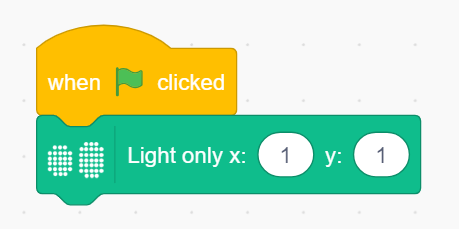

### Turn off x() y()
<!-- 这是一张图片，ocr 内容为： -->
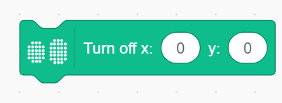

Turn off the LED at coordinate (x, y).

Example:

<!-- 这是一张图片，ocr 内容为： -->
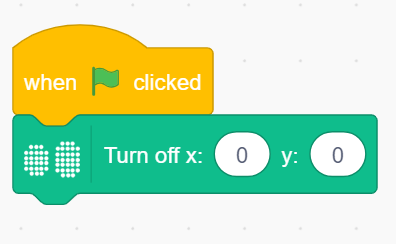

### Toggle x() y()
<!-- 这是一张图片，ocr 内容为： -->
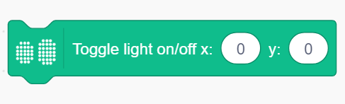

Switch the LED at (x, y) between on and off.

Example:

<!-- 这是一张图片，ocr 内容为： -->
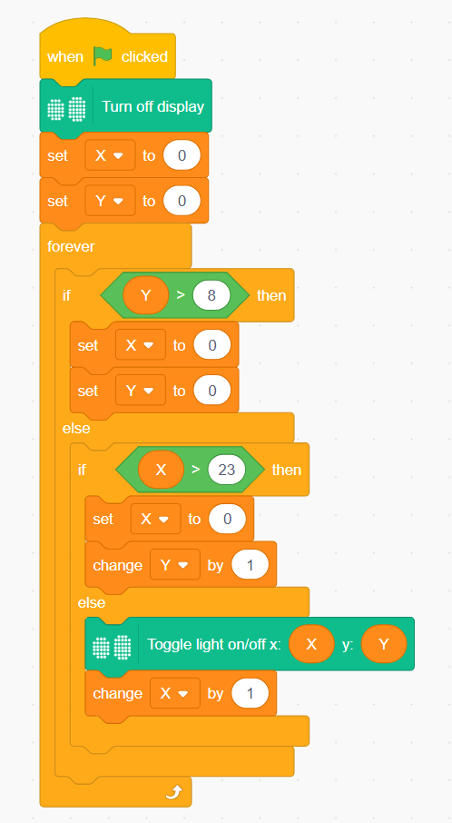

### Set tail light color（）
<!-- 这是一张图片，ocr 内容为： -->

Change the tail light to a selected color.

Example:

<!-- 这是一张图片，ocr 内容为： -->
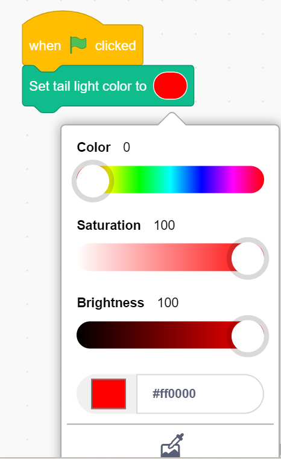

### Set tail light color to R() G() B()
<!-- 这是一张图片，ocr 内容为： -->
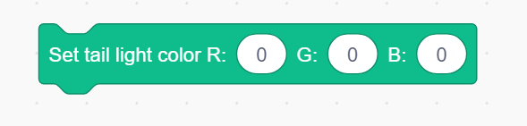

Set RGB values for the tail light.

Example:

<!-- 这是一张图片，ocr 内容为： -->
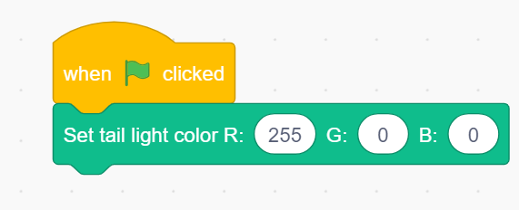

### Turn off display
<!-- 这是一张图片，ocr 内容为： -->

Turn off the matrix display.

Example:

<!-- 这是一张图片，ocr 内容为： -->
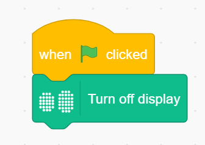

## Audio
### Upload Audio File
<!-- 这是一张图片，ocr 内容为： -->
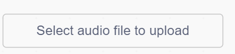

Choose and upload a custom audio file, and assign a filename.

<!-- 这是一张图片，ocr 内容为： -->
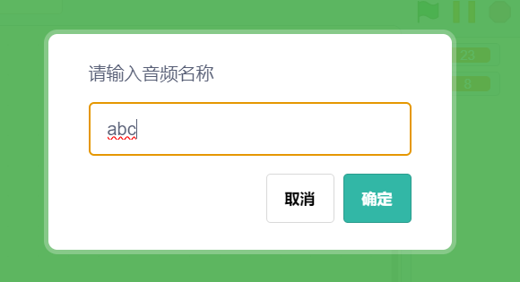

### Set volume to ()
<!-- 这是一张图片，ocr 内容为： -->

Set playback volume (range: 0–10).

### Play music () until finished
<!-- 这是一张图片，ocr 内容为： -->

Play selected audio file; wait until it finishes before continuing the next action.

Example:

<!-- 这是一张图片，ocr 内容为： -->

### Play music ()
<!-- 这是一张图片，ocr 内容为： -->

Play the selected audio file immediately.

Example:

<!-- 这是一张图片，ocr 内容为： -->
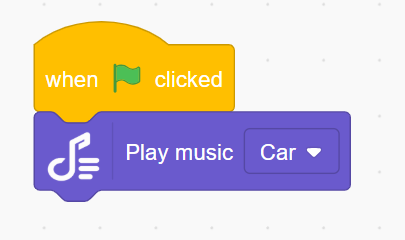

### Stop playback
<!-- 这是一张图片，ocr 内容为： -->

Stop the current audio.

### () Play local audio ()
<!-- 这是一张图片，ocr 内容为： -->

Play an uploaded audio file in real-time.

Example:

<!-- 这是一张图片，ocr 内容为： -->
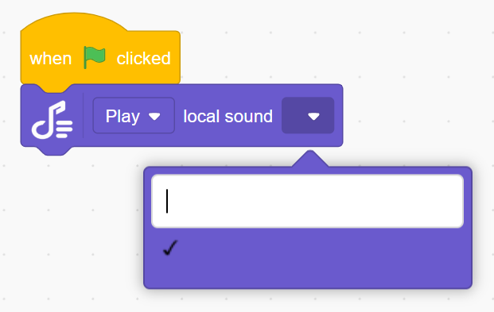

## Actuators
### Robot's gripper at port ( ) (open/close)
<!-- 这是一张图片，ocr 内容为： -->
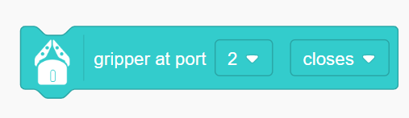

ontrol the gripper at the selected port.

Example:

<!-- 这是一张图片，ocr 内容为： -->
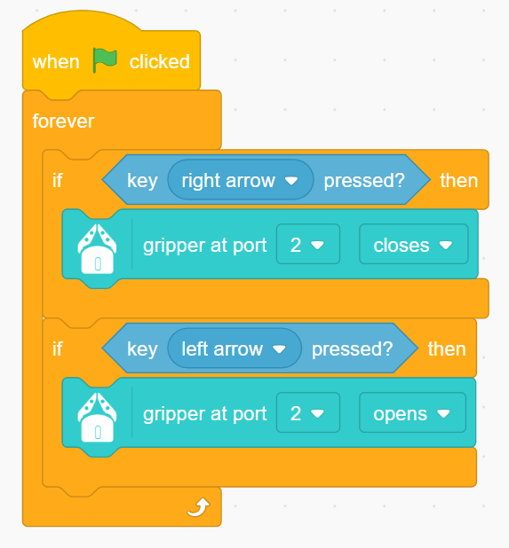

### Robot's gripper at port ( ) (open/close) until done
<!-- 这是一张图片，ocr 内容为： -->

Control the gripper and wait until action completes before next step.

Example:

<!-- 这是一张图片，ocr 内容为： -->
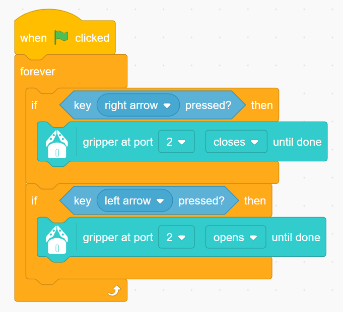

### Robot's launcher at port ( ) shoots (number) ball
<!-- 这是一张图片，ocr 内容为： -->
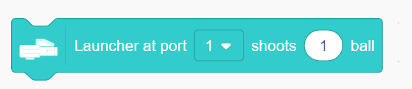

Launch specified number of marbles from selected port.

Example:

<!-- 这是一张图片，ocr 内容为： -->

### Robot's launcher at port ( ) shoots ( ) ball until done
<!-- 这是一张图片，ocr 内容为： -->

Launch and wait until finished before proceeding.

Example:

<!-- 这是一张图片，ocr 内容为： -->
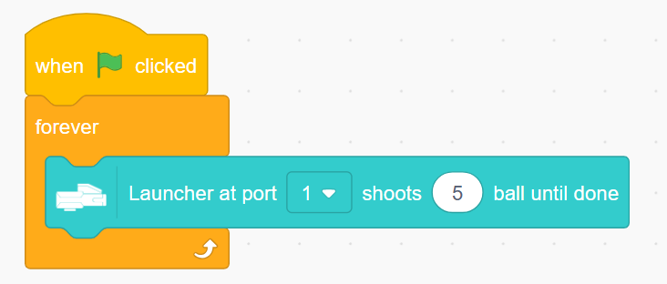

## Sensors
### Button (A/B) pressed
<!-- 这是一张图片，ocr 内容为： -->
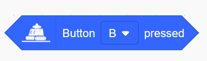

Detect if left or right button is pressed.

Example:

<!-- 这是一张图片，ocr 内容为： -->
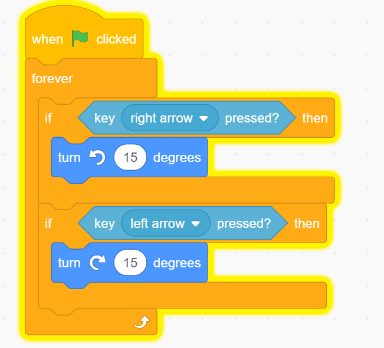

### Sound（）（）
<!-- 这是一张图片，ocr 内容为： -->
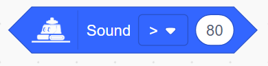

Check if detected sound is greater/less than/equal to a value.

Example:

<!-- 这是一张图片，ocr 内容为： -->
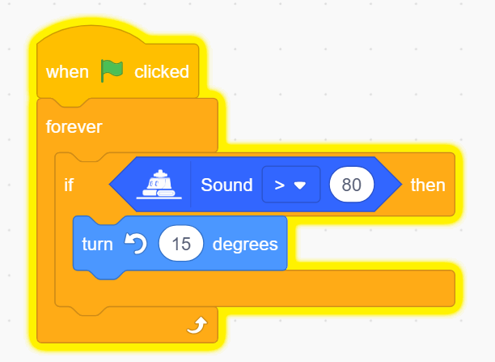

### Current sound level
<!-- 这是一张图片，ocr 内容为： -->

Return the detected sound level.

Example:

<!-- 这是一张图片，ocr 内容为： -->

### Current battery level
<!-- 这是一张图片，ocr 内容为： -->

Return remaining battery.

Example:

<!-- 这是一张图片，ocr 内容为： -->
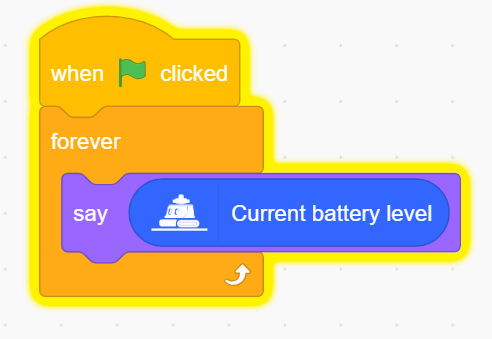

### （）current speed
<!-- 这是一张图片，ocr 内容为： -->
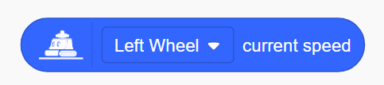

Get current speed of each wheel.

Example:

<!-- 这是一张图片，ocr 内容为： -->

### Privacy switch status
<!-- 这是一张图片，ocr 内容为： -->

Return status of privacy switch.

Example:

<!-- 这是一张图片，ocr 内容为： -->

### （）movement distance
<!-- 这是一张图片，ocr 内容为： -->

Return the movement distance.

Example:

<!-- 这是一张图片，ocr 内容为： -->

### Set line-following sensor to () mode
<!-- 这是一张图片，ocr 内容为： -->

Choose binary/gray/color  mode.

Example:

<!-- 这是一张图片，ocr 内容为： -->

### Run Line Following Sensor Binary Learning
<!-- 这是一张图片，ocr 内容为： -->

Set Line Following Sensor to binary mode learning.

Example:

<!-- 这是一张图片，ocr 内容为： -->

### Run  Line Following Sensor Learning () Colour
<!-- 这是一张图片，ocr 内容为： -->

Learn a specific color.

Example:

<!-- 这是一张图片，ocr 内容为： -->

### Value detected by the roving sensor probe ( )
<!-- 这是一张图片，ocr 内容为： -->

Get value from probe (L1, L2, M, R2, R1).

Example:

<!-- 这是一张图片，ocr 内容为： -->

### Line Following probe () detects ()
<!-- 这是一张图片，ocr 内容为： -->

Check if probe detects specific color.

Example:

<!-- 这是一张图片，ocr 内容为： -->

### Line Following probe () value () ()
<!-- 这是一张图片，ocr 内容为： -->

Whether the detected value is greater than/less than/equal to the specified value

Example:

<!-- 这是一张图片，ocr 内容为： -->
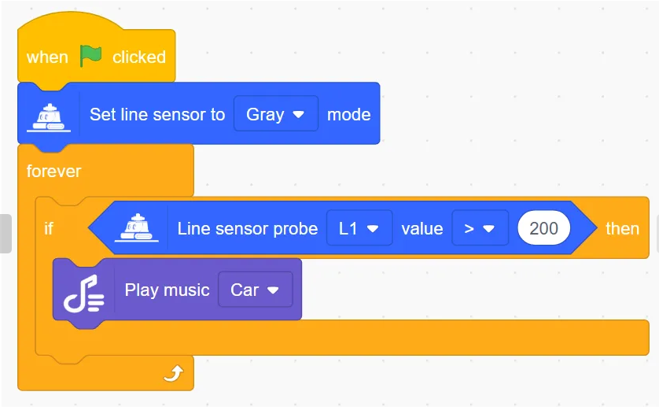

### Turn off Line Following sensor
<!-- 这是一张图片，ocr 内容为： -->

Disable Turn off Line Following sensor.

Example:

<!-- 这是一张图片，ocr 内容为： -->
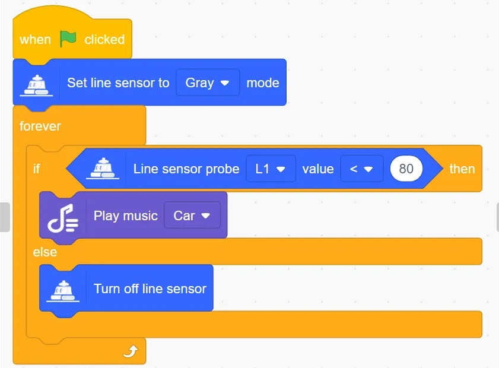

### Start auto line following at () speed
<!-- 这是一张图片，ocr 内容为： -->

Allow robots to automatically patrol lines at low/medium/high speeds

Example:

<!-- 这是一张图片，ocr 内容为： -->

### Start auto line following at () speed until state is ()
<!-- 这是一张图片，ocr 内容为： -->

Controls the robot to start auto-touring at low/medium/high speeds until the value of the five probes is the set value and then stops auto-touring.

Example:

<!-- 这是一张图片，ocr 内容为： -->

### Stop auto line following
<!-- 这是一张图片，ocr 内容为： -->

Stop line-following behavior.

Example:

<!-- 这是一张图片，ocr 内容为： -->

## External Microbit Module
### Port () Servo rotates to () degrees
<!-- 这是一张图片，ocr 内容为： -->

Set servo rotation degree

### **Port ()** Set the servo motor to **()**
<!-- 这是一张图片，ocr 内容为： -->

Set servo motor mode

### **Port ()** Servo motor rotates at a speed of **()**
<!-- 这是一张图片，ocr 内容为： -->

Set motor rotation speed

### **Port ()** Servo motor rotates at a speed of **() for () seconds**
<!-- 这是一张图片，ocr 内容为： -->

 Set motor rotation speed and time

### Port () Servo motor rotates at speed **()** to **()** degrees  
<!-- 这是一张图片，ocr 内容为： -->

Set motor rotation speed and rotate to a fixed angle

### Port () servor motor rotates at speed () for () degrees
<!-- 这是一张图片，ocr 内容为： -->
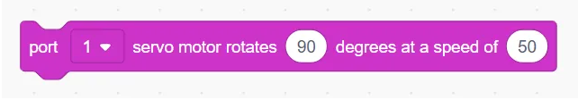

Set motor rotation speed and angle

### Port () servor motor stop
<!-- 这是一张图片，ocr 内容为： -->

Set motor to stop rotation

### Port () Get current angle
<!-- 这是一张图片，ocr 内容为： -->

Get current angle

### **Port ()** Laser sensor set to **() **brightness **()**
<!-- 这是一张图片，ocr 内容为： -->

Set laser sensor brightness and switch state

### Port () fan runs at a speed of () ()
<!-- 这是一张图片，ocr 内容为： -->

Set fan speed and switch state

### Port（）（）（sensor）
<!-- 这是一张图片，ocr 内容为： -->

Set sensor switch state

### **Port ()** Detects joystick **()**
<!-- 这是一张图片，ocr 内容为： -->

Judge joystick state

### Port () Joystick () direction
<!-- 这是一张图片，ocr 内容为： -->

Get joystick X or Y direction value

### Port () Ultrasonic sensor distance
<!-- 这是一张图片，ocr 内容为： -->

Get ultrasonic sensor distance value

### **Port ()** Potentiometer
<!-- 这是一张图片，ocr 内容为： -->

Get potentiometer sensor value

### Port () Hall sensor
<!-- 这是一张图片，ocr 内容为： -->

Get Hall sensor value

### Port () PIR sensor
<!-- 这是一张图片，ocr 内容为： -->

Get human infrared sensor value

