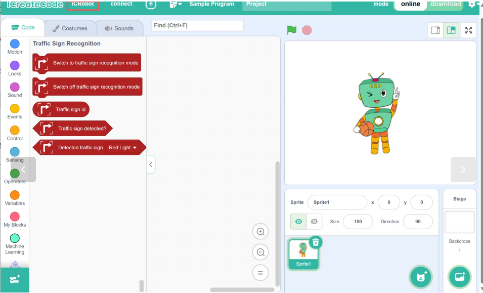
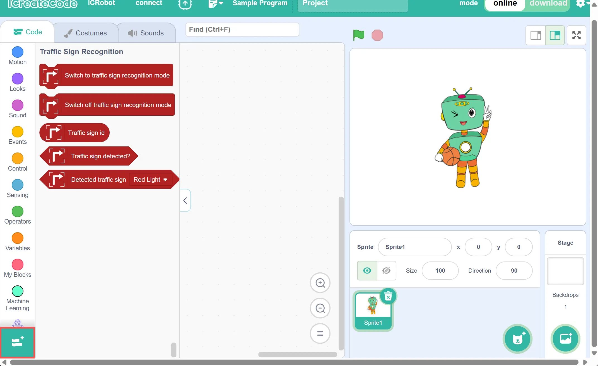
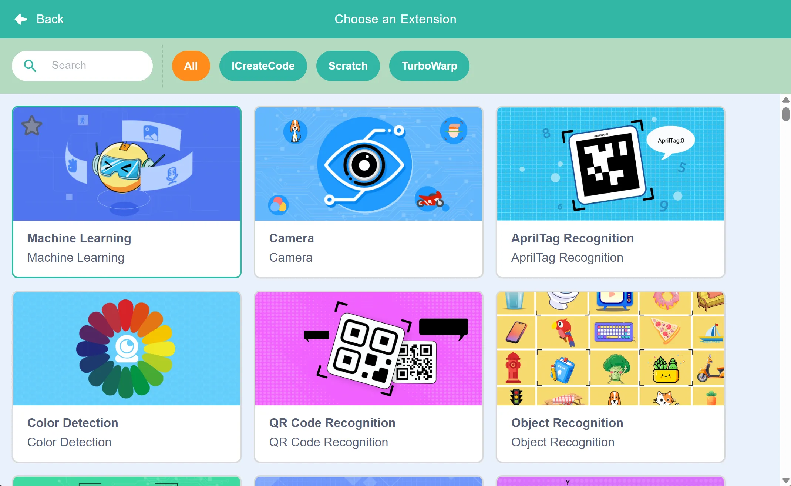
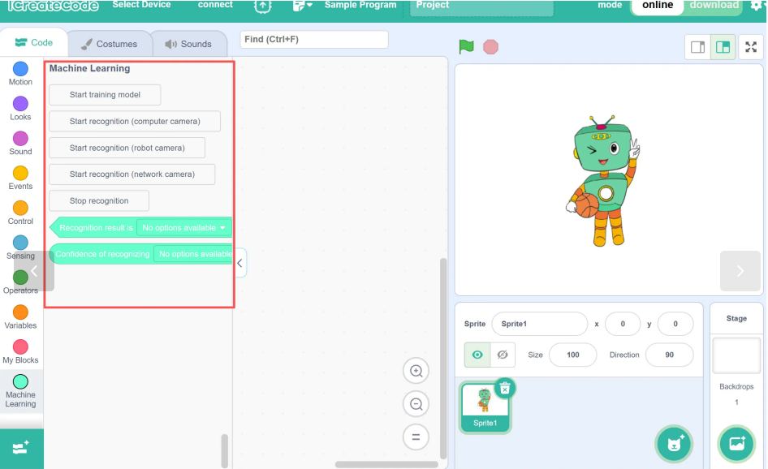

# Extended Block Addition Method
To enrich the programming experience with ICRobot, users can add extension blocks. These blocks function like modular add-ons in block-based programming. By dragging and combining them, users can create more advanced and diverse functionalities. For example:

+ **Face Recognition Block: **Detects and recognizes human faces in images. Suitable for interactive scenarios.
+ **Color Recognition Block: **Identifies the color of an object. Useful for sorting, tracking, and classification tasks.

These extensions make ICRobot's coding more intuitive and powerful — ideal for users of different ages and skill levels.

_**Note: Extensions can only be used in Interactive Mode.**_

| <!-- 这是一张图片，ocr 内容为： -->
 | <!-- 这是一张图片，ocr 内容为： -->
 |
| --- | --- |
| Step 1: Open the software and make sure you are in ICRobot Mode. | Step 2: Click the “<!-- 这是一张图片，ocr 内容为： -->
” button at the lower-left corner of the screen. |
| <!-- 这是一张图片，ocr 内容为： -->
 | <!-- 这是一张图片，ocr 内容为： -->
 |
| Step 3: In the extension window, select the block you wish to add. | Step 4: Once added successfully, the new blocks will appear in the Block Instruction Area. |

