# Machine Learning Blocks
## Start training model
<!-- 这是一张图片，ocr 内容为： -->
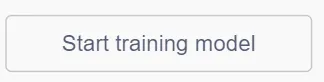

Click to enter the machine learning interface.

## Start recognition (computer camera)
<!-- 这是一张图片，ocr 内容为： -->
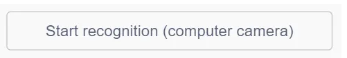

Enable the computer's camera to recognize using the trained model.

## Start recognition (robot camera)
<!-- 这是一张图片，ocr 内容为： -->
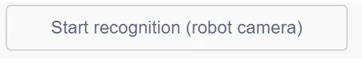

Turn on the robot's camera and start recognition.

## Stop Recognition
<!-- 这是一张图片，ocr 内容为： -->
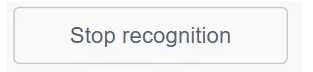

Stop recognition and turn off the robot camera and computer's camera.

## Start Recognition (Web Camera)
<!-- 这是一张图片，ocr 内容为： -->
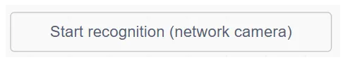

Enable an external network camera and start recognition.

## Recognition result is ()
<!-- 这是一张图片，ocr 内容为： -->
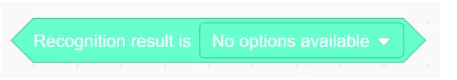

Check whether the recognized result matches the selected category.

## Confidence of recognizing ()
<!-- 这是一张图片，ocr 内容为： -->
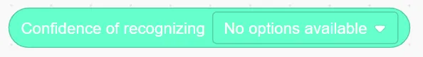

Return the confidence score for the specified category.

## Example
Train two machine learning models and use programming logic to make the character respond differently based on which model is successfully recognized.

## Operation Steps
| <!-- 这是一张图片，ocr 内容为： -->
 | <!-- 这是一张图片，ocr 内容为： -->
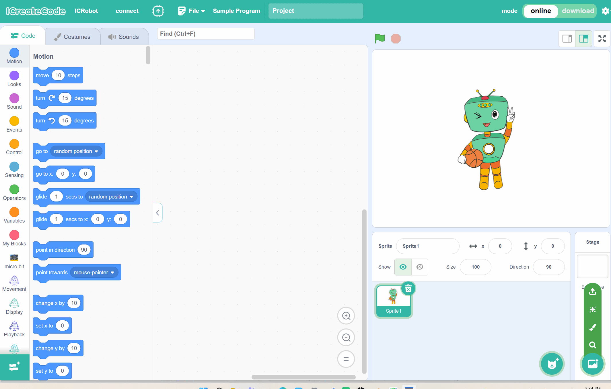 |
| --- | --- |
| Step 1: Connect ICRobot to the programming software (refer to AP/STA connection method). | Step 2: Add the Machine Learning Extension. |
| <!-- 这是一张图片，ocr 内容为： -->
![]IMG/M10.gif) | <!-- 这是一张图片，ocr 内容为： -->
 |
| Step 3: Click "Start Training Model" to select the training type: image recognition, gesture recognition, or pose recognition. | Step 4: Choose to Create a New Project or Import an Existing Project. |
| <!-- 这是一张图片，ocr 内容为： -->
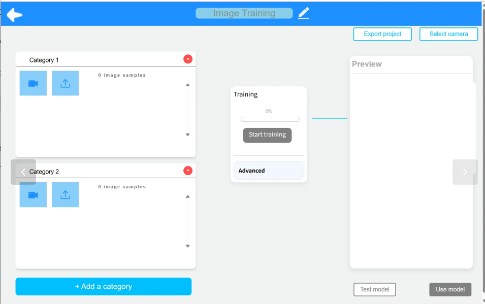 | <!-- 这是一张图片，ocr 内容为： -->
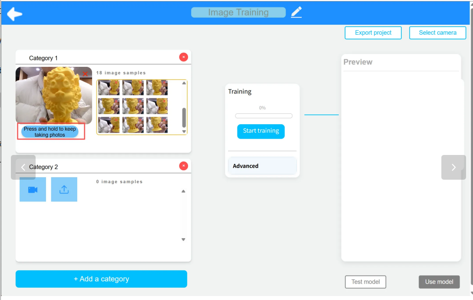 |
| Step 5: Click the camera icon under each category to enable the corresponding camera. | Step 6: Continuously capture training images using the camera. |
| <!-- 这是一张图片，ocr 内容为： -->
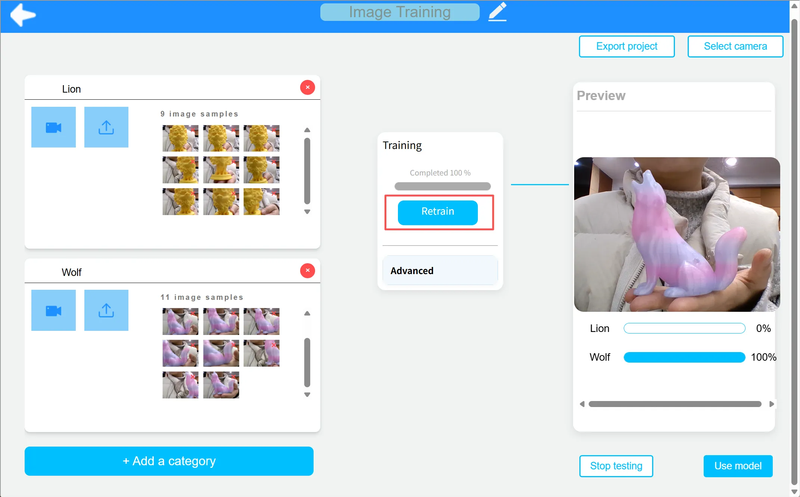 |  |
| Step 7: Click the "Train Model" button to begin training. If you want to save the project, click “Export Project” in the top-right corner. Click "Use Model" in the bottom-right corner to return to the block programming interface. |  |

## Demonstration
<!-- 这是一张图片，ocr 内容为： -->

