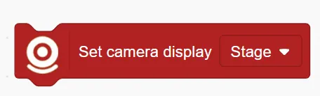
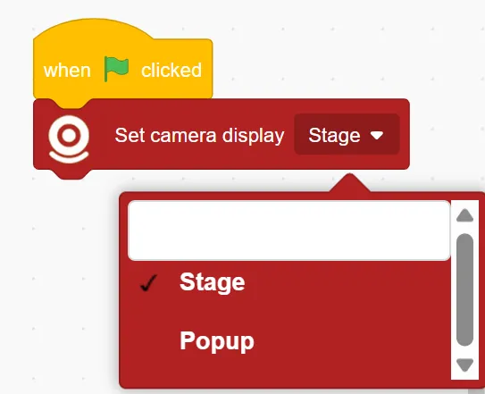
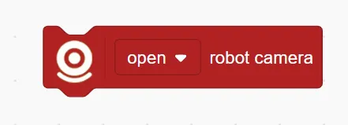
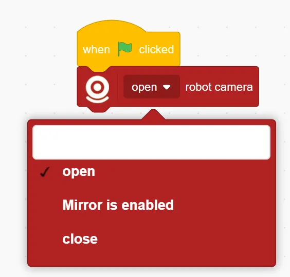
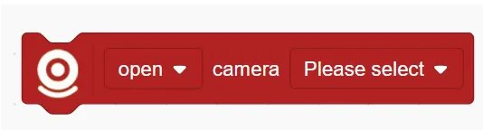
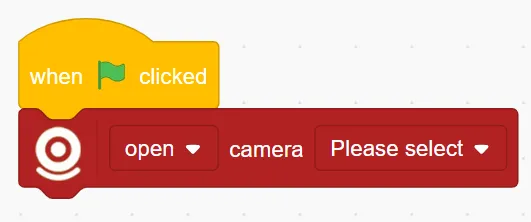
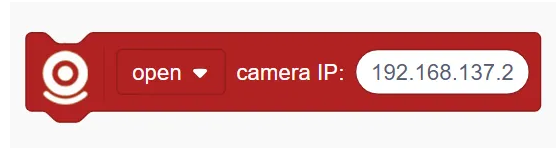
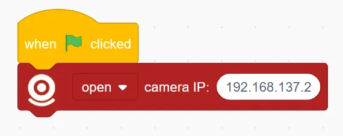
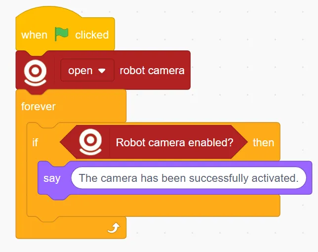

# Vision Recognition Blocks
## Set Camera Display ()
<!-- 这是一张图片，ocr 内容为： -->

Sets where the camera feed is shown:

Options include Stage Area Display or Popup Window Display

Example

<!-- 这是一张图片，ocr 内容为： -->

## () Robot Camera
<!-- 这是一张图片，ocr 内容为： -->

Controls the robot's built-in camera:

Options: open / Mirror is enabled / close

Example:

<!-- 这是一张图片，ocr 内容为： -->

## () Computer Camera ()
<!-- 这是一张图片，ocr 内容为： -->

Controls the computer's built-in or external camera:

Options: open / Mirror is enabled / close

Example: 

<!-- 这是一张图片，ocr 内容为： -->

## () Camera IP ()
<!-- 这是一张图片，ocr 内容为： -->

Controls an IP camera over the network:

Options: open / Mirror is enabled / close

Example:

<!-- 这是一张图片，ocr 内容为： -->

## Robot Camera Enabled Successfully?
<!-- 这是一张图片，ocr 内容为： -->

Checks whether the robot's camera has been successfully enabled. 

Returns a true/false value.

Example:

<!-- 这是一张图片，ocr 内容为： -->

