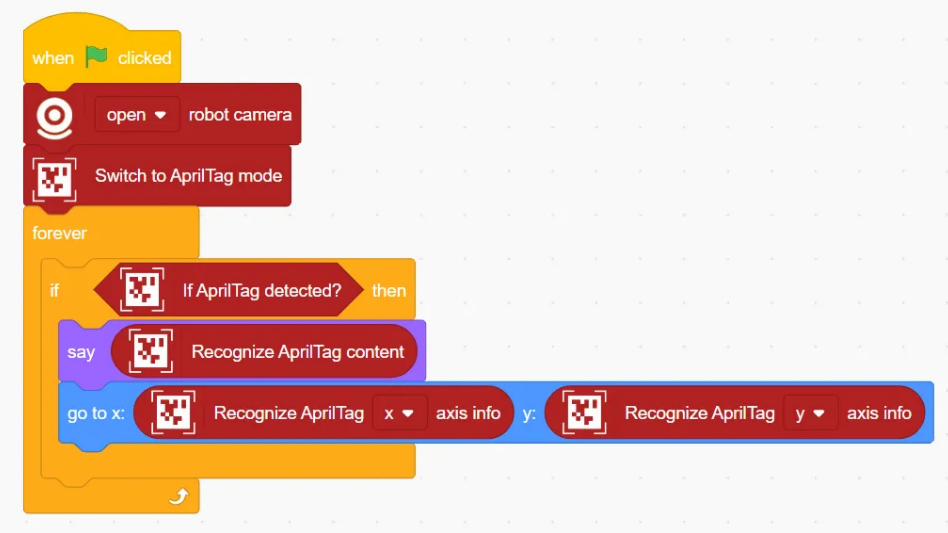
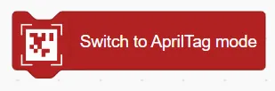
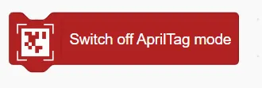
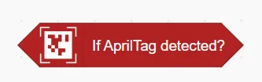
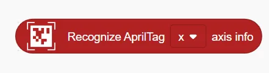
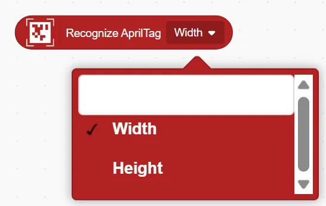

# AprilTag Detection Blocks
## Example
<!-- 这是一张图片，ocr 内容为： -->

## Switch to AprilTag Mode
<!-- 这是一张图片，ocr 内容为： -->

Enables AprilTag recognition using the computer's camera.

## Switch off AprilTag Mode
<!-- 这是一张图片，ocr 内容为： -->

Disables AprilTag recognition.

## If AprilTag detected?
<!-- 这是一张图片，ocr 内容为： -->

Checks whether an AprilTag has been successfully detected.

## Recognize AprilTag Content
<!-- 这是一张图片，ocr 内容为： -->

Returns the content (ID) of the detected AprilTag.

## Recognize AprilTag () axis info
<!-- 这是一张图片，ocr 内容为： -->

Get the x or y axis position information of the code recognised by the AprilTag code.

## Recognize AprilTag ()
<!-- 这是一张图片，ocr 内容为： -->

Get the contents of the recognised AprilTag code

