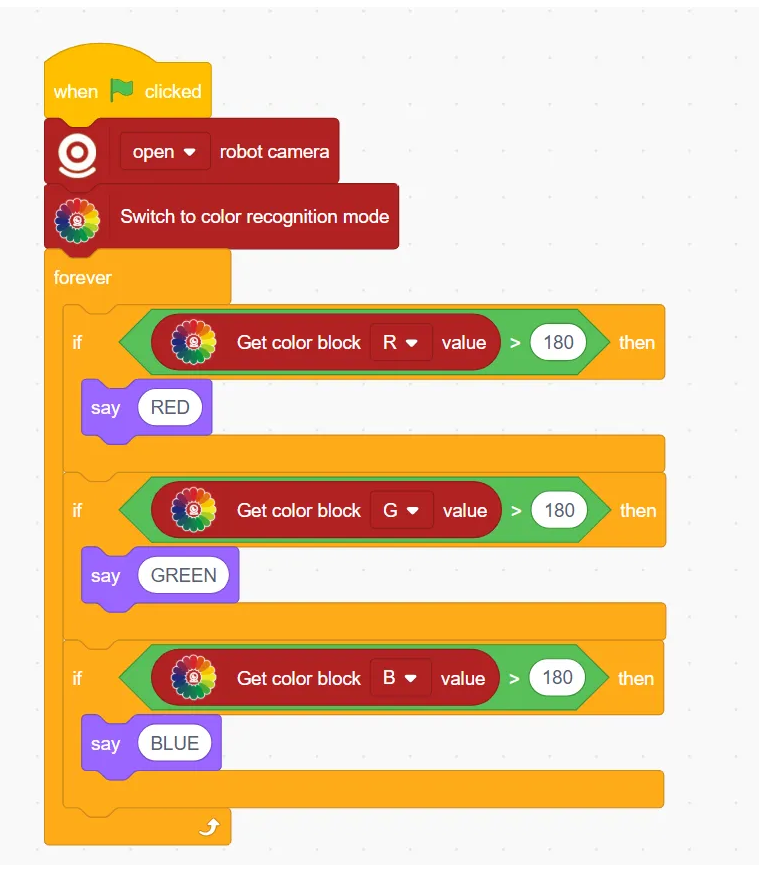

# Color Detection Blocks
## Example
<!-- 这是一张图片，ocr 内容为： -->

## Switch to Color Recognition Mode
<!-- 这是一张图片，ocr 内容为： -->

Enables color recognition using the computer camera.

## Switch off Color Recognition Mode
<!-- 这是一张图片，ocr 内容为： -->

Disables the color recognition feature.

## Get Color Block () Value
<!-- 这是一张图片，ocr 内容为： -->

Returns the RGB value of the detected color block.

