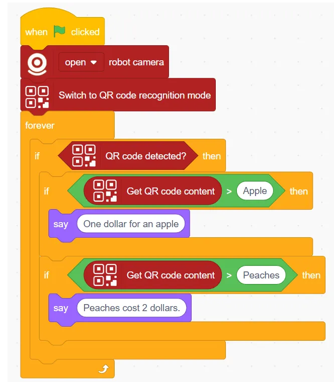
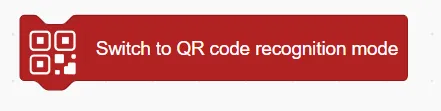
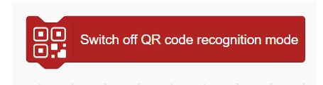
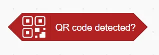
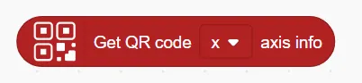

# QR Code Recognition Blocks
## Example
<!-- 这是一张图片，ocr 内容为： -->

## Switch to QR code recognition mode
<!-- 这是一张图片，ocr 内容为： -->

Enable the QR code recognition.

## Switch off QR code recognition mode
<!-- 这是一张图片，ocr 内容为： -->

Disable QR Code Recognition Mode

## QR code detected?
<!-- 这是一张图片，ocr 内容为： -->

Determine whether the QR code is recognised or not

## Get QR code content
<!-- 这是一张图片，ocr 内容为： -->

Get the content recognised by the QR code

## Get QR code () axis info
<!-- 这是一张图片，ocr 内容为： -->

Get the coordinate information of the x or y axis of the QR code.

## Get QR code ()
<!-- 这是一张图片，ocr 内容为： -->

Get the width or height of the QR code

