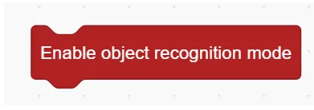
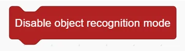
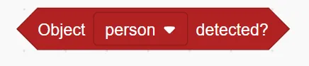

# Object Recognition Blocks
## Example
<!-- 这是一张图片，ocr 内容为： -->

## Enable Object Recognition Mode
<!-- 这是一张图片，ocr 内容为： -->

Enable object recognition mode

## Disable Object Recognition Mode
<!-- 这是一张图片，ocr 内容为： -->

Disable object recognition mode

## Object Detected ( )
<!-- 这是一张图片，ocr 内容为： -->

Detect whether the specified object is recognised or not

## Get Object Position ()
<!-- 这是一张图片，ocr 内容为： -->

Get the x,y position of the object

## Get Object ()
<!-- 这是一张图片，ocr 内容为： -->

Get the width/height of the object

