# Face Detection Blocks
## Example
<!-- 这是一张图片，ocr 内容为： -->
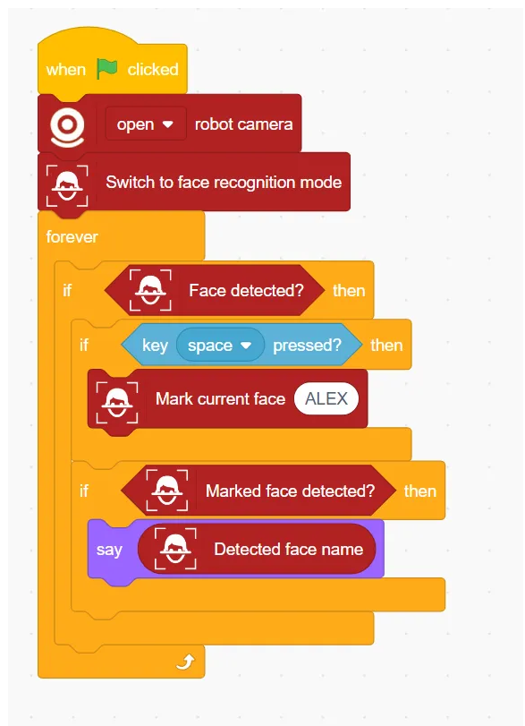

## Switch to face recognition mode
<!-- 这是一张图片，ocr 内容为： -->
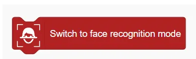

Enable Face Recognition Mode

## Switch off face recognition mode
<!-- 这是一张图片，ocr 内容为： -->
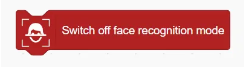

Disable Face Recognition Mode

## Face detected?
<!-- 这是一张图片，ocr 内容为： -->
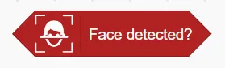

Determine if a face is detected

## Number of faces detected
<!-- 这是一张图片，ocr 内容为： -->
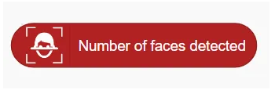

Returns the number of faces detected

## Get face position ()
<!-- 这是一张图片，ocr 内容为： -->
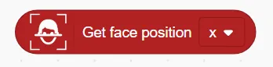

Get face position (X or Y)

## Get face ()
<!-- 这是一张图片，ocr 内容为： -->
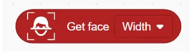

Get the position information of the face in the x or y axis.

## Mark Current Face ()
<!-- 这是一张图片，ocr 内容为： -->
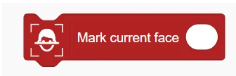

Mark the current face as a specified name (for subsequent recognition)

## Reset faces
<!-- 这是一张图片，ocr 内容为： -->
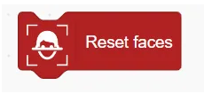

Reset (delete) all marked faces

## Marked face detected?
<!-- 这是一张图片，ocr 内容为： -->
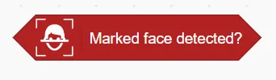

Determine whether a marked face has been detected

## Detected face name
<!-- 这是一张图片，ocr 内容为： -->
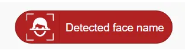

Returns the name of the detected face

