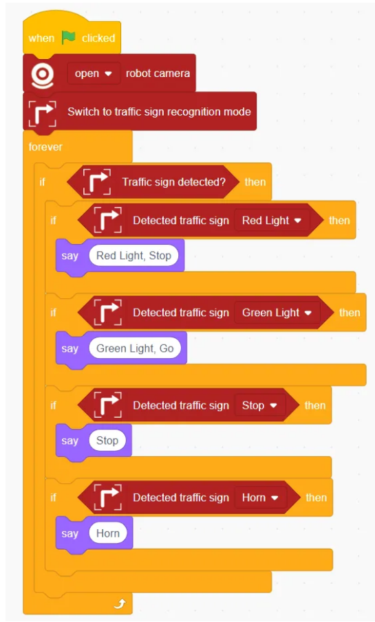
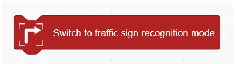
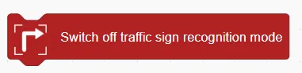
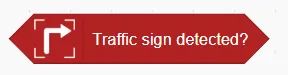
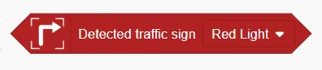

# Road Sign Recognition Blocks
## Example
<!-- 这是一张图片，ocr 内容为： -->

## Switch to traffic sign recognition mode
<!-- 这是一张图片，ocr 内容为： -->

Enables the robot's road sign recognition function.

## Switch off traffic sign recognition mode
<!-- 这是一张图片，ocr 内容为： -->

Disables the road sign recognition function.

## Traffic sign id
<!-- 这是一张图片，ocr 内容为： -->

Returns the ID of the detected road sign.

## Traffic sign detected?
<!-- 这是一张图片，ocr 内容为： -->

Checks whether any road sign has been detected. Returns true/false.

## Detected traffic sign ()
<!-- 这是一张图片，ocr 内容为： -->

This program command is used to make the robot automatically perform corresponding actions based on the traffic signs detected by the camera, such as red light, green light,  stop, horn, turn left, turn right.

