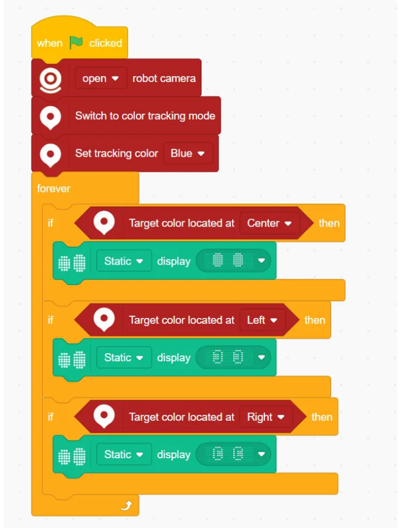
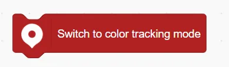
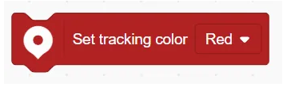

# Color Position Tracking Blocks
## Example
<!-- 这是一张图片，ocr 内容为： -->

## Switch to color tracking mode
<!-- 这是一张图片，ocr 内容为： -->

Activates the color position tracking mode.

## Switch off color tracking mode
<!-- 这是一张图片，ocr 内容为： -->

Deactivates the color position tracking mode.

## Set tracking color ()
<!-- 这是一张图片，ocr 内容为： -->

Sets the color to be tracked.

## Target color is located at ()
<!-- 这是一张图片，ocr 内容为： -->

Determines where the target color appears on the screen:  Center / Left/ Right/ Top/ Bottom.

