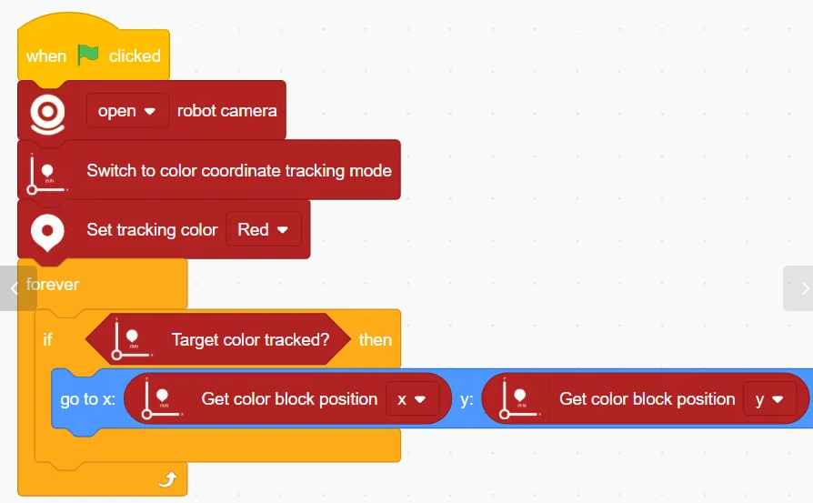
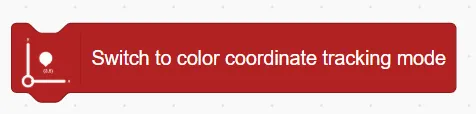
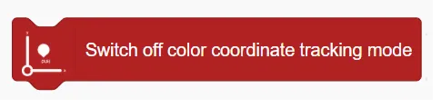
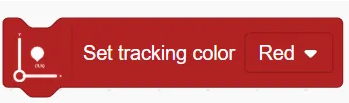
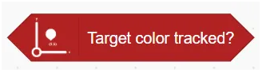
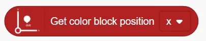
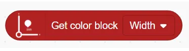

# Color Coordinate Tracking Blocks
## Example
<!-- 这是一张图片，ocr 内容为： -->

## Switch to color coordinate tracking mode 
<!-- 这是一张图片，ocr 内容为： -->

Enable Color Coordinate Tracking Mode 

## Switch off color coordinate tracking mode
<!-- 这是一张图片，ocr 内容为： -->

Disable Color Coordinate Tracking Mode

## Set tracking color ()
<!-- 这是一张图片，ocr 内容为： -->

Sets the target color to be tracked.

## Target color tracked?
<!-- 这是一张图片，ocr 内容为： -->

Checks whether the target color is currently detected.

## Get color block position ()
<!-- 这是一张图片，ocr 内容为： -->

Get the position information of the x or y axis of the colour block.

## Get color block ()
<!-- 这是一张图片，ocr 内容为： -->

Get the width or height of the colour block.

