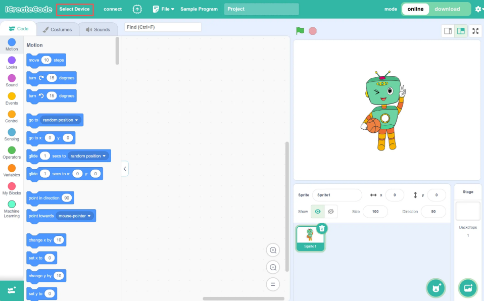
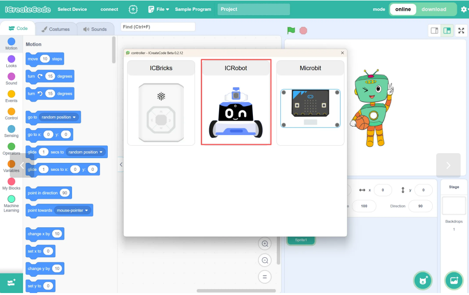
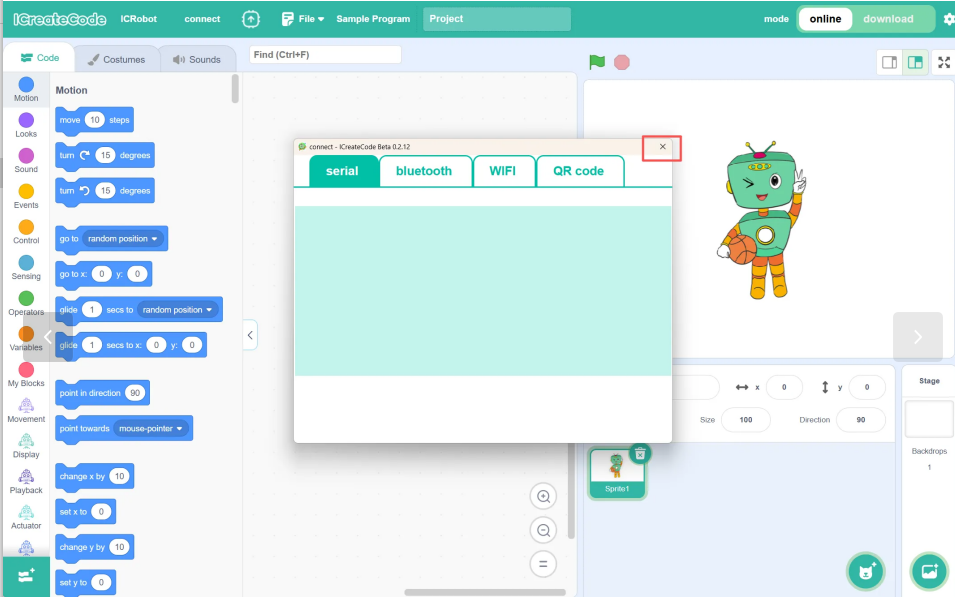
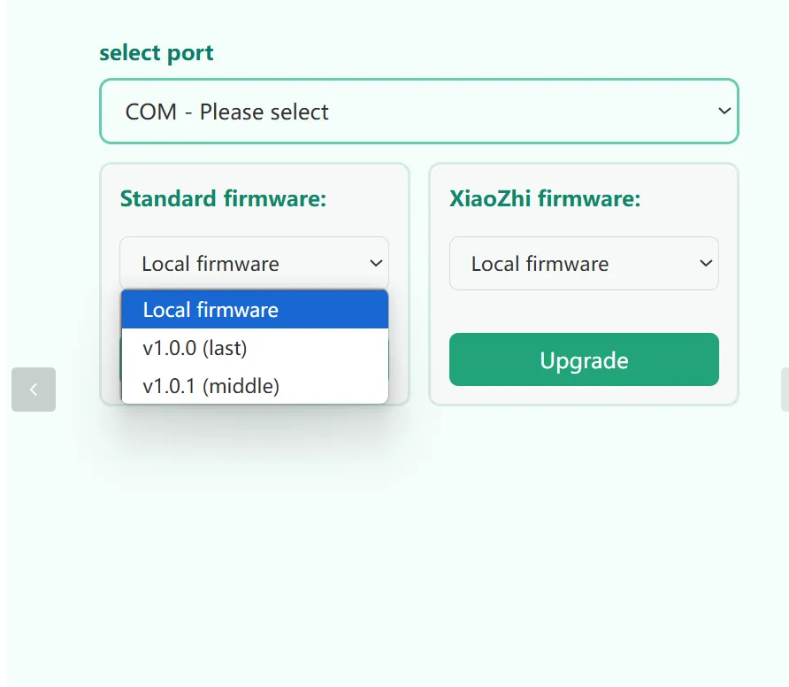
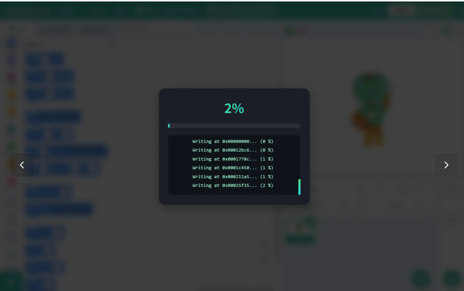
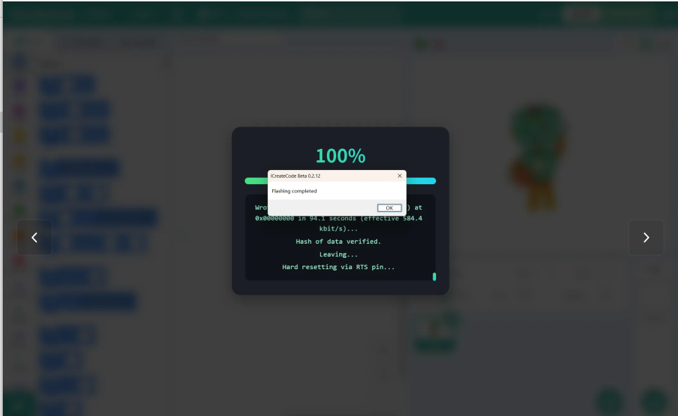

# Firmware Switching
## Instructions
ICRobot provides two modes of use: programming and Xiaozhi AI, and the factory default is programming mode. If you need to switch to Xiaozhi AI mode, you need to update its internal firmware. Please refer to this document for specific operation steps.

## Steps
| <!-- 这是一张图片，ocr 内容为：PG EN PGUP HUM 7 8 5 ENTER -->
 | |
| :---: | --- |
| Step 1: Connect the device by linking the ICRobot to the computer and powering on the ICRobot. | |
| <!-- 这是一张图片，ocr 内容为： -->
 | <!-- 这是一张图片，ocr 内容为： -->
 |
| Step 2: Open the software and click “Select Device.” | Step 3: Choose “ICRobot.” |
| <!-- 这是一张图片，ocr 内容为： -->
 | <!-- 这是一张图片，ocr 内容为： -->
 |
| Step 4: Close the connection method directly. | Step 5: Select the “Firmware Burning” option. |
| <!-- 这是一张图片，ocr 内容为： -->
 | <!-- 这是一张图片，ocr 内容为： -->
 |
| Step 6: Choose the correct COM port for firmware burning. | Step 7: Select the firmware type to be flashed, such as Programming Interaction or Xiaozhi AI Interaction. After selecting, click Upgrade. |
| <!-- 这是一张图片，ocr 内容为： -->
 | <!-- 这是一张图片，ocr 内容为： -->
 |
| Step 8: No further action is required. Wait for the firmware flashing to complete. | Step 9: Once the firmware flashing is complete, the process is finished. |

 

