# micro : bit Block Guide
## micro:bit V2 Mainboard  
### Matrix  
#### Display Image ( )
<!-- 这是一张图片，ocr 内容为： -->
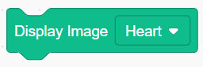

Used to display the specified pattern from the drop-down list on the micro:bit mainboard.

Example:

<!-- 这是一张图片，ocr 内容为： -->
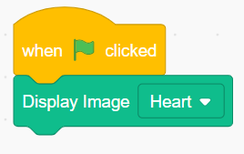

#### Display Icon ( )
<!-- 这是一张图片，ocr 内容为： -->
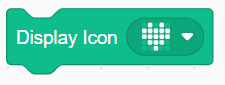

Used to display manually drawn patterns on the micro:bit mainboard

Example:

<!-- 这是一张图片，ocr 内容为： -->
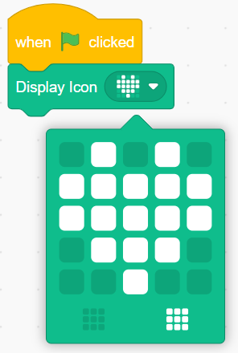

#### Display String ( )  
<!-- 这是一张图片，ocr 内容为： -->
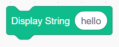

Used to display the input string on the micro:bit mainboard.

Example:

<!-- 这是一张图片，ocr 内容为： -->
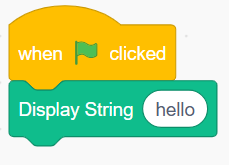

#### Scroll Display String ( )  
<!-- 这是一张图片，ocr 内容为： -->

Used to scroll and display the string on the micro:bit mainboard.

Example:

<!-- 这是一张图片，ocr 内容为： -->
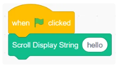

#### Set Pixel x( ) y( ) Brightness ( )  
<!-- 这是一张图片，ocr 内容为： -->

Allows you to set the brightness of the pixel at coordinates x, y.

Example:

<!-- 这是一张图片，ocr 内容为： -->
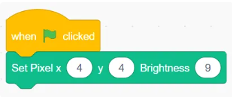

#### Clear Display
<!-- 这是一张图片，ocr 内容为： -->

Clears the display content on the dot matrix.

Example:

<!-- 这是一张图片，ocr 内容为： -->
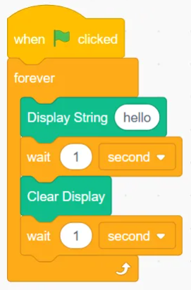

### Sensor
#### When Button ( ) Pressed
<!-- 这是一张图片，ocr 内容为： -->

Check if the selected button is pressed.

Example:

<!-- 这是一张图片，ocr 内容为： -->
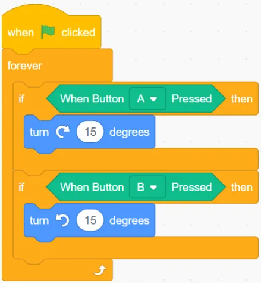

#### Brightness
<!-- 这是一张图片，ocr 内容为： -->

Returns the current environmental brightness.  
Example:

<!-- 这是一张图片，ocr 内容为： -->

#### Temperature  
<!-- 这是一张图片，ocr 内容为： -->
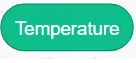

Returns the current environmental temperature.  
Example:

<!-- 这是一张图片，ocr 内容为： -->

#### Sound
<!-- 这是一张图片，ocr 内容为： -->

Returns the current environmental sound.  
Example:

<!-- 这是一张图片，ocr 内容为： -->

#### Compass Calibrate
<!-- 这是一张图片，ocr 内容为： -->
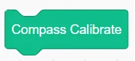

Calibrate the internal compass of the micro:bit.

Example:

<!-- 这是一张图片，ocr 内容为： -->
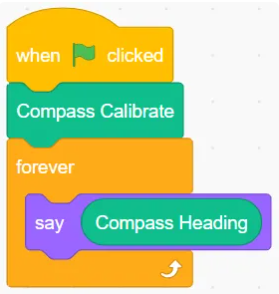

#### Compass Heading
<!-- 这是一张图片，ocr 内容为： -->

The micro:bit has a compass sensor that can measure its orientation or azimuth angle based on magnetic north.

Example:

<!-- 这是一张图片，ocr 内容为： -->
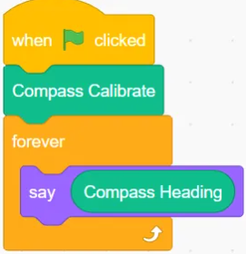

#### Magnetic Strength（ ）
<!-- 这是一张图片，ocr 内容为： -->

You can use the compass as a magnetometer to measure the magnetic field strength. It can do this in 3 dimensions and can simultaneously measure the overall magnetic field strength in all dimensions.  

<!-- 这是一张图片，ocr 内容为： -->
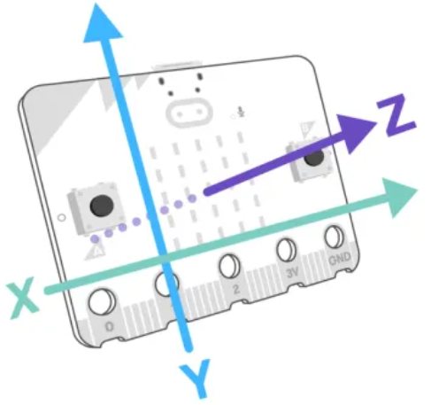

Example:

<!-- 这是一张图片，ocr 内容为： -->
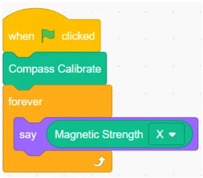

#### **( ) Gesture**
<!-- 这是一张图片，ocr 内容为： -->

Determines whether a specific gesture is detected.

Example:

<!-- 这是一张图片，ocr 内容为： -->
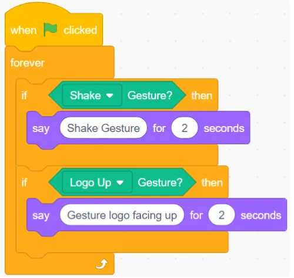

#### Acceleration ( )
<!-- 这是一张图片，ocr 内容为： -->

Get the acceleration along the three axes (X, Y, Z).  

Example:

<!-- 这是一张图片，ocr 内容为： -->
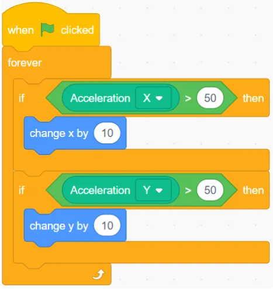	

### Music
#### Play Music( )
<!-- 这是一张图片，ocr 内容为： -->

Play the selected music

Example:

<!-- 这是一张图片，ocr 内容为： -->

#### Set Playback Speed ( )
<!-- 这是一张图片，ocr 内容为： -->

You can set the rhythm or speed of the music played on the micro:bit:

Example:

<!-- 这是一张图片，ocr 内容为： -->
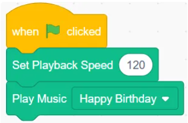

#### Tone Frequency ( ) Continuous Play  
<!-- 这是一张图片，ocr 内容为： -->

The micro:bit can play sounds defined by frequency or pitch.  

Example:

<!-- 这是一张图片，ocr 内容为： -->
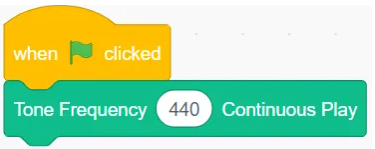

#### Stop Continuous Play
<!-- 这是一张图片，ocr 内容为： -->

Stop Continuous Sound Playback  

Example:

<!-- 这是一张图片，ocr 内容为： -->
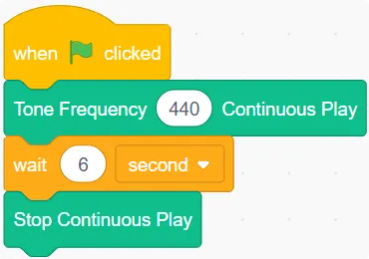

#### 语音 说（）
<!-- 这是一张图片，ocr 内容为： -->

Control the micro:bit to speak the input text using speech.

Example:

<!-- 这是一张图片，ocr 内容为： -->

#### Play Expressive Sound ( )
<!-- 这是一张图片，ocr 内容为： -->

Control the micro:bit to play expressive sounds.

Example:

<!-- 这是一张图片，ocr 内容为： -->
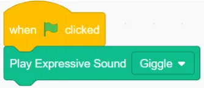

#### Set Volume（ ）
<!-- 这是一张图片，ocr 内容为： -->

Set volume of the sound played

Example:

<!-- 这是一张图片，ocr 内容为： -->
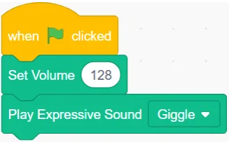

#### （ ）Speaker
<!-- 这是一张图片，ocr 内容为： -->

Turn Off/On the Speaker

Example:

<!-- 这是一张图片，ocr 内容为： -->
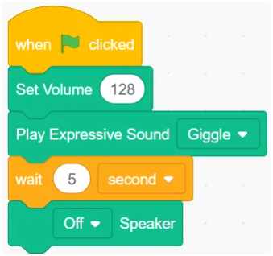

## micro:bit V2 Peripheral
#### Long Range Photoelectric Sensor ( )
<!-- 这是一张图片，ocr 内容为： -->

Get the value of the long-distance photoelectric sensor

Example:

<!-- 这是一张图片，ocr 内容为： -->
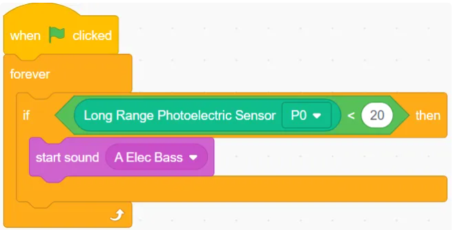

#### Potentiometer ( )
<!-- 这是一张图片，ocr 内容为： -->

Get the potentiometer's return value

Example:

<!-- 这是一张图片，ocr 内容为： -->
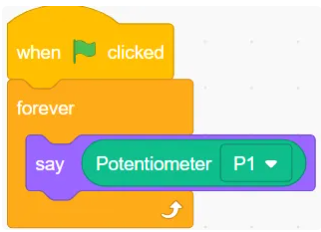

#### Gray Level Sensor（ ）
<!-- 这是一张图片，ocr 内容为： -->

Get the grayscale sensor value

Example:

<!-- 这是一张图片，ocr 内容为： -->
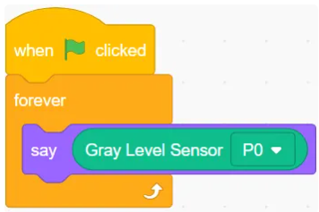

#### Photosensitive Sensor ( )
<!-- 这是一张图片，ocr 内容为： -->
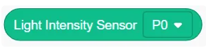
Get the photosensitive sensor value

Example:

<!-- 这是一张图片，ocr 内容为： -->

#### Flame Sensor ( )
<!-- 这是一张图片，ocr 内容为： -->
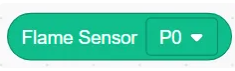

Get the flame sensor value.

Example:

<!-- 这是一张图片，ocr 内容为： -->
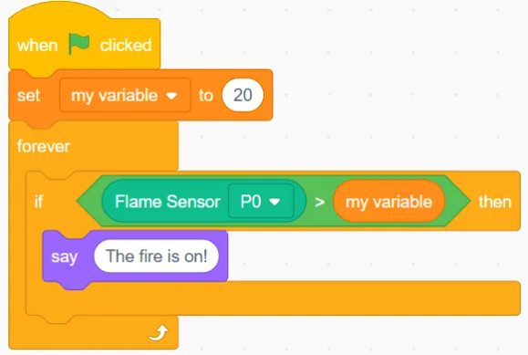

#### Water Level Sensor( )
<!-- 这是一张图片，ocr 内容为： -->

Get the water level sensor value.

Example:

<!-- 这是一张图片，ocr 内容为： -->
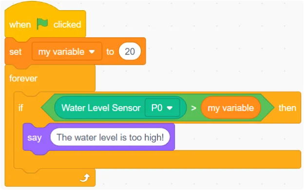

#### MQ-2 Gas Sensor （ ）
<!-- 这是一张图片，ocr 内容为： -->

Get the MQ-2 gas sensor value.

Example:

<!-- 这是一张图片，ocr 内容为： -->
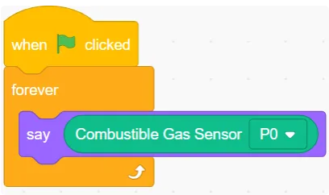

#### Soil Moisture Sensor ( )
 <!-- 这是一张图片，ocr 内容为： -->

Get the soil moisture sensor value.

Example:

<!-- 这是一张图片，ocr 内容为： -->
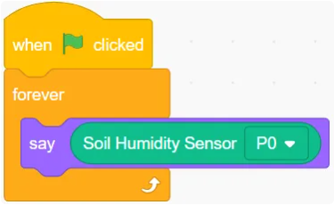

#### Temperature Sensor ( )
<!-- 这是一张图片，ocr 内容为： -->

Get the temperature sensor value.

Example:

<!-- 这是一张图片，ocr 内容为： -->
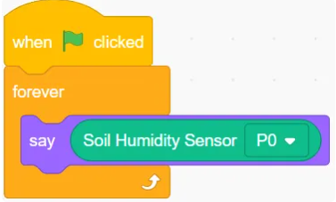

#### Hall Sensor ( )
<!-- 这是一张图片，ocr 内容为： -->

Get the hall sensor value.

Example:

<!-- 这是一张图片，ocr 内容为： -->
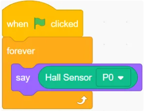

#### Button Sensor ( )
<!-- 这是一张图片，ocr 内容为： -->

Get the button sensor value.

Example:

<!-- 这是一张图片，ocr 内容为： -->
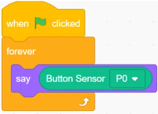

#### Ultrasonic Sensor (P13, P0) Unit cm
<!-- 这是一张图片，ocr 内容为： -->

Get the value obtained by the ultrasonic sensor.

Example:

<!-- 这是一张图片，ocr 内容为： -->
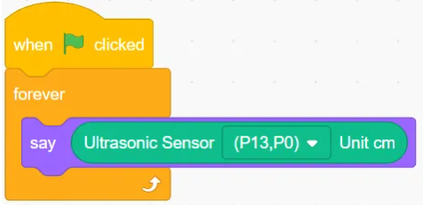

#### Detect Rocker（ ）
<!-- 这是一张图片，ocr 内容为： -->
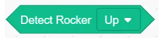

Determine the direction of the detected joystick.

Example:

<!-- 这是一张图片，ocr 内容为： -->
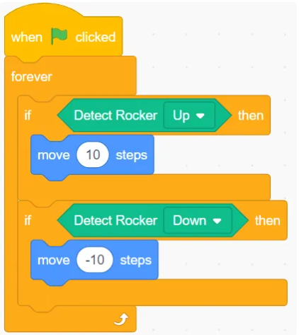

#### Rocker ( ) Direction
<!-- 这是一张图片，ocr 内容为： -->

Return the detected joystick direction.  

Example:

<!-- 这是一张图片，ocr 内容为： -->
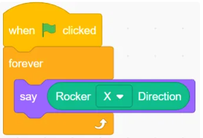

### Action
#### Servo ( ) Angle ( )
<!-- 这是一张图片，ocr 内容为： -->

Control the servo to rotate to a specific angle.

Example:

<!-- 这是一张图片，ocr 内容为： -->
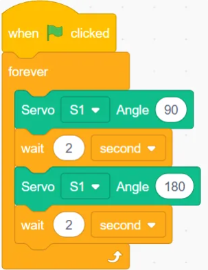

#### Motor ( ) Angle ( )
<!-- 这是一张图片，ocr 内容为： -->

Control the Motor to Rotate at a Specified Speed  

Example:

<!-- 这是一张图片，ocr 内容为： -->
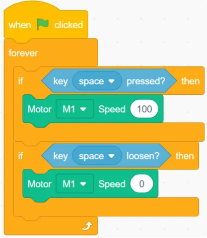

#### Fan ( ) Switch to ( )
<!-- 这是一张图片，ocr 内容为： -->

Control the Fan to Toggle Between On/Off States

Example:

<!-- 这是一张图片，ocr 内容为： -->
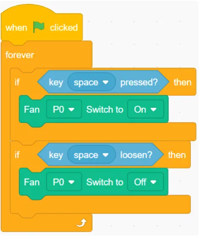

#### Electromagnet ( ) Switch to ( )
<!-- 这是一张图片，ocr 内容为： -->
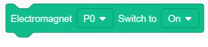

Control the Electromagnet to Toggle Between On/Off States  

Example:

<!-- 这是一张图片，ocr 内容为： -->
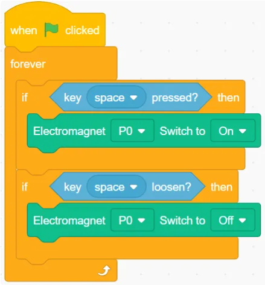

#### Read（ ）Motor Position
<!-- 这是一张图片，ocr 内容为： -->

Get the position of different motors.

Example:

<!-- 这是一张图片，ocr 内容为： -->
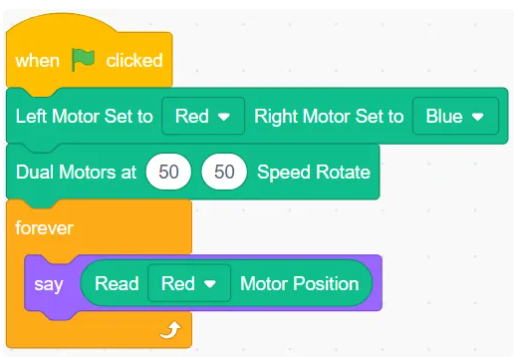

#### **Left Motor Set to ( ) Right Motor Set to ( )**
<!-- 这是一张图片，ocr 内容为： -->

Assign different colors to different motors

Example:

<!-- 这是一张图片，ocr 内容为： -->
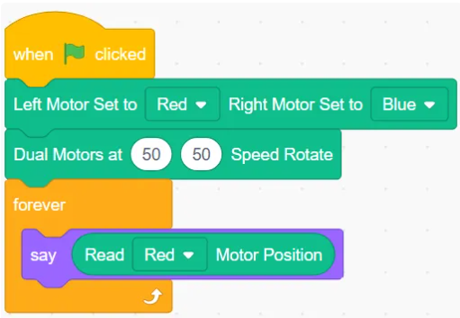

#### Dual Motors at ( ) ( ) Speed Rotate ( ) Seconds
<!-- 这是一张图片，ocr 内容为： -->
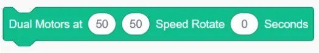

Control each motor in the dual motor setup to rotate at the specified speed for a given time.

Example:

<!-- 这是一张图片，ocr 内容为： -->
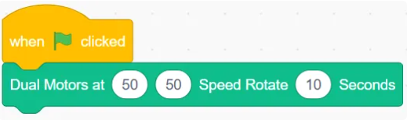

#### Dual Motors at ( ) ( ) Speed Rotate ( ) Degrees
<!-- 这是一张图片，ocr 内容为： -->
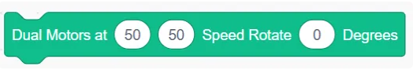

Control Each Motor in Dual Motor Setup to Rotate at a Specified Speed for a Given Angle

Example:

<!-- 这是一张图片，ocr 内容为： -->

#### Dual Motors at ( ) ( ) Speed Rotate
<!-- 这是一张图片，ocr 内容为： -->

Control Each Motor in Dual Motor Setup to Rotate Continuously at Given Speed

Example:

<!-- 这是一张图片，ocr 内容为： -->

#### Motor at ( ) Speed Rotate ( ) Degrees
<!-- 这是一张图片，ocr 内容为： -->

Control different colored motors to rotate at a given speed and a specified angle.

Example:

<!-- 这是一张图片，ocr 内容为： -->

#### ( ) Motor at ( ) Speed Rotate ( ) Seconds
<!-- 这是一张图片，ocr 内容为： -->

Control different colored motors to rotate at a given speed for a specified time.  

Example:

<!-- 这是一张图片，ocr 内容为： -->

#### ( ) Motor at ( ) Speed Go to ( ) Position
<!-- 这是一张图片，ocr 内容为： -->

Control the specified motor to rotate at a given speed to a specified position.

Example:

<!-- 这是一张图片，ocr 内容为： -->

#### ( ) Motor at ( ) Speed Rotate
<!-- 这是一张图片，ocr 内容为： -->

Control the motor of a specified color to rotate at a specified speed.

Example:

<!-- 这是一张图片，ocr 内容为： -->

### Light & Sound
#### LED（ ）Switch to ( )
<!-- 这是一张图片，ocr 内容为： -->

Control LED to toggle between on/off states.

Example:

<!-- 这是一张图片，ocr 内容为： -->

#### Light Ring ( ) Set Brightness ( )
<!-- 这是一张图片，ocr 内容为： -->

Set the brightness of the specified light ring.

Example:

<!-- 这是一张图片，ocr 内容为： -->

#### Light Ring ( ) Display Color ( )
<!-- 这是一张图片，ocr 内容为： -->

Set the specified light ring to display a color.

Example:

<!-- 这是一张图片，ocr 内容为： -->

#### Initialize OLED
<!-- 这是一张图片，ocr 内容为： -->

Used to initialize the OLED module.

Example:

<!-- 这是一张图片，ocr 内容为： -->

#### Display Text ( ) at X ( ) Y ( ) with Color Mode ( )
<!-- 这是一张图片，ocr 内容为： -->

Set the text content, display position, and display mode.

Example:

<!-- 这是一张图片，ocr 内容为： -->

#### Clear OLED
<!-- 这是一张图片，ocr 内容为： -->

Clear the OLED display.  

Example:

<!-- 这是一张图片，ocr 内容为： -->

#### Laser ( ) Switch to ( )
<!-- 这是一张图片，ocr 内容为： -->

Control the laser module to switch between on and off states

Example:

<!-- 这是一张图片，ocr 内容为： -->

#### Recording Module-Play（ ）
<!-- 这是一张图片，ocr 内容为： -->

Control the Recording Module to Play a Specified Sound.

Example:

<!-- 这是一张图片，ocr 内容为： -->

