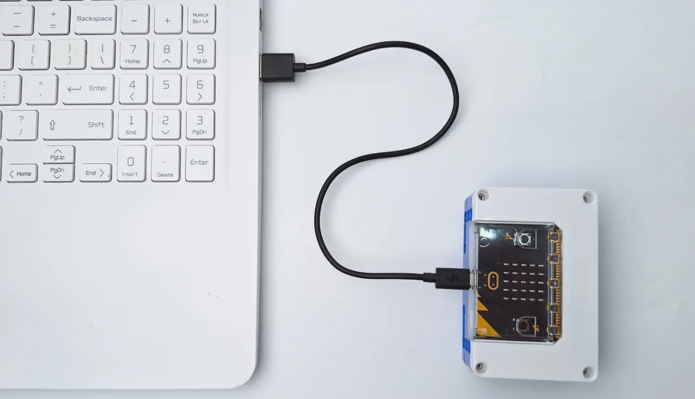
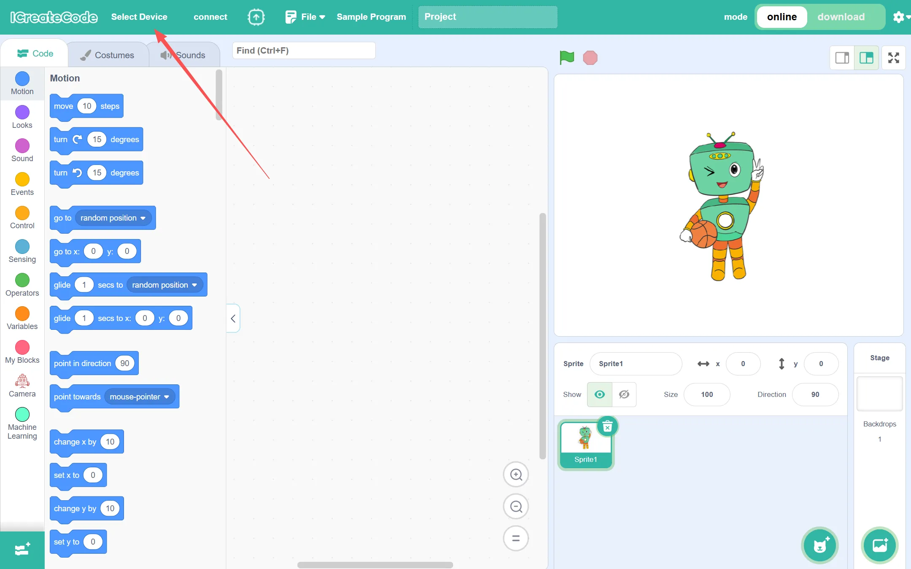
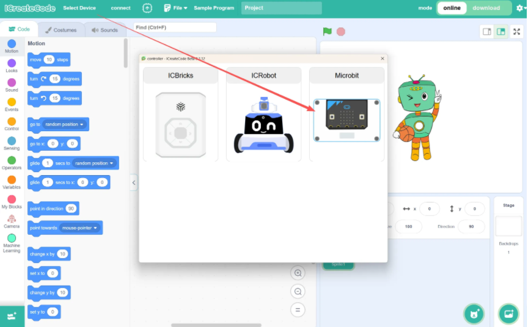
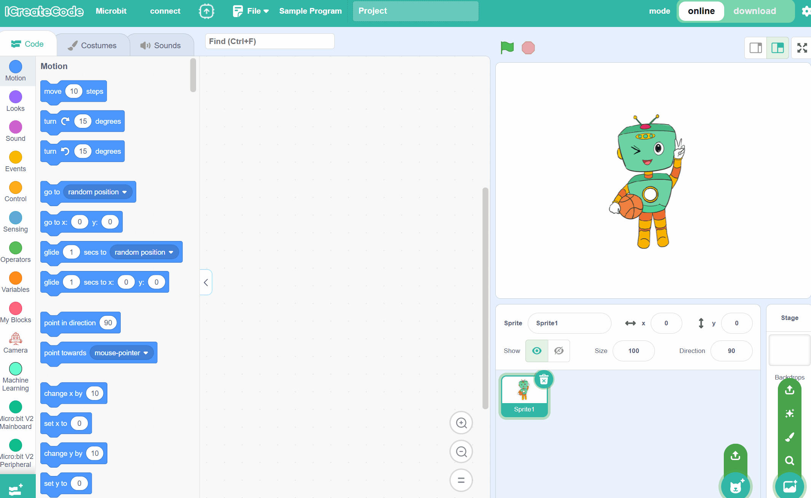
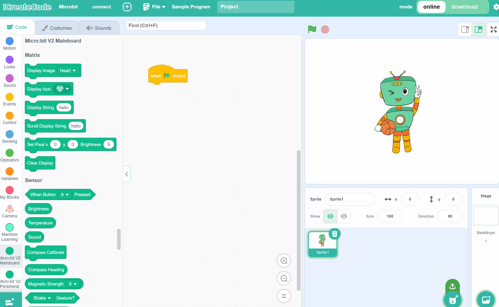
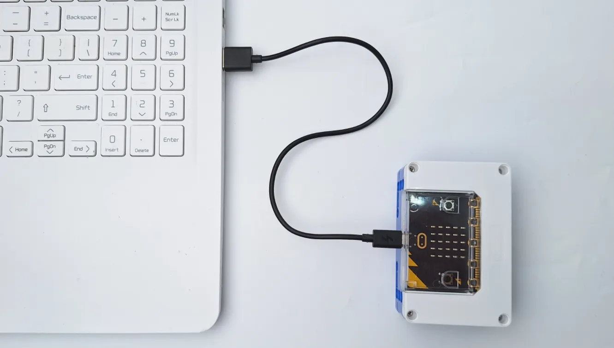
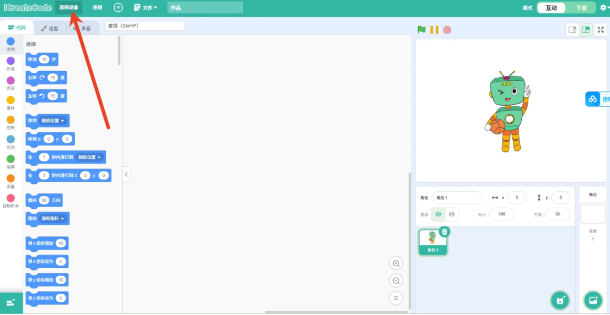
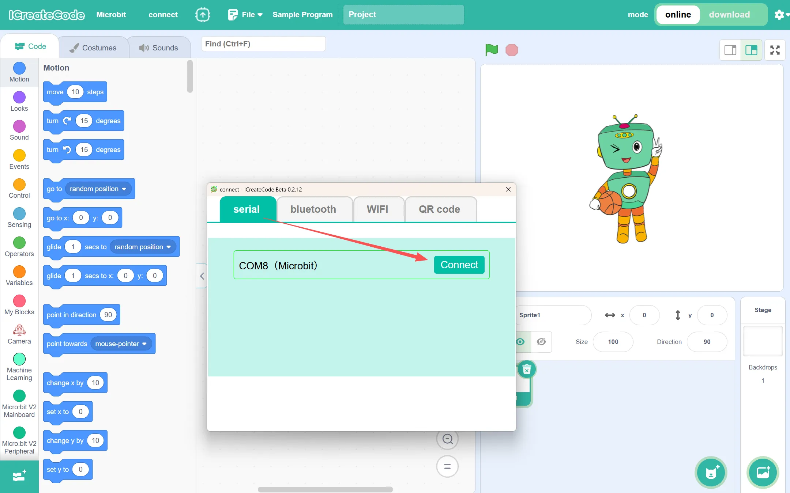
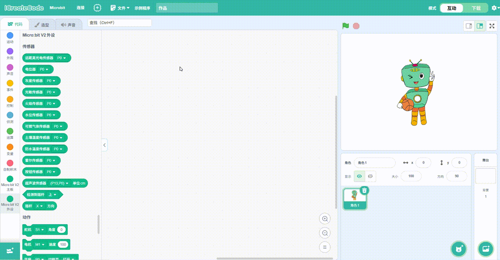
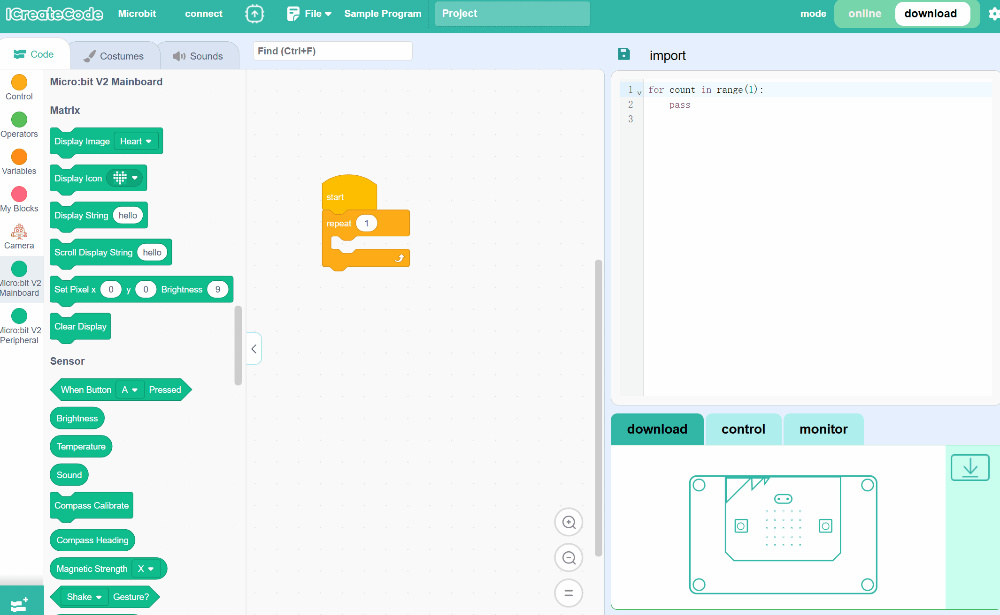

# User's Guide
## Online Mode (Interactive Mode）
Note: The micro:bit core board needs to be version V2.00 or higher.

**Steps:**

| <!-- 这是一张图片，ocr 内容为： -->
 | <!-- 这是一张图片，ocr 内容为： -->
 |
| --- | --- |
| Step 1. Use a data cable to connect the PC to the core board. (For all subsequent steps, the device must remain connected to the computer.) | Step 2. Open the programming software and click "Select Device".   |
| <!-- 这是一张图片，ocr 内容为： -->
 | <!-- 这是一张图片，ocr 内容为： -->
 |
| Step 3. Select micro:bit.   | Step 4. In the Serial Port section, select the corresponding serial port to establish the connection.   |
| <!-- 这是一张图片，ocr 内容为： -->
 | <!-- 这是一张图片，ocr 内容为： -->
 |
| Step 5. Click ⬆️ to begin the firmware flashing process. + Click Microbit Firmware to flash the firmware. Once the flashing is complete, a message will pop up indicating that the flashing is complete. Click Confirm to acknowledge the completion. + You can judge whether the download was successful by observing the yellow indicator light on the core board. If it is flashing, the download is in progress; once it stops flashing and remains solid, the download is complete. + After the download is complete, unplug the download cable and reconnect. The core board will display a heart-shaped dot matrix pattern. + (This step ensures that the core board can work with the commands in the programming software. If the core board displays the heart-shaped pattern after reconnecting, no further download is necessary.) | Step 6. Program and Run In Interactive Mode, drag the blocks into the programming area. Click the green flag to run the program directly. (In Interactive Mode, ensure that the Microbit core board is connected to the computer.) |

## Download Mode
**Steps:**

| <!-- 这是一张图片，ocr 内容为： -->
 | <!-- 这是一张图片，ocr 内容为： -->
 |
| --- | --- |
| Step 1. Use a data cable to connect the PC to the core board. (For all subsequent steps, the device must remain connected to the computer.) | Step 2. Open the programming software and click "Select Device".   |
| <!-- 这是一张图片，ocr 内容为： -->
 | <!-- 这是一张图片，ocr 内容为： -->
 |
| Step 3. Select micro:bit.   | Step 4. In the Serial Port section, select the corresponding serial port to establish the connection.   |
| <!-- 这是一张图片，ocr 内容为： -->
 | <!-- 这是一张图片，ocr 内容为： -->
 |
| Step 5. Click ⬆️ to begin the firmware flashing process. + Click Microbit Firmware to flash the firmware. Once the flashing is complete, a message will pop up indicating that the flashing is complete. Click Confirm to acknowledge the completion. + You can judge whether the download was successful by observing the yellow indicator light on the core board. If it is flashing, the download is in progress; once it stops flashing and remains solid, the download is complete. + After the download is complete, unplug the download cable and reconnect. The core board will display a heart-shaped dot matrix pattern. + (This step ensures that the core board can work with the commands in the programming software. If the core board displays the heart-shaped pattern after reconnecting, no further download is necessary.) | Step 6.Program and Download to Run   During the download process, you can determine whether the download is successful by checking the progress bar in the software or the yellow indicator light on the core board. If the light is flashing, the download is in progress; once it stops flashing and remains solid, the download is complete.   |

